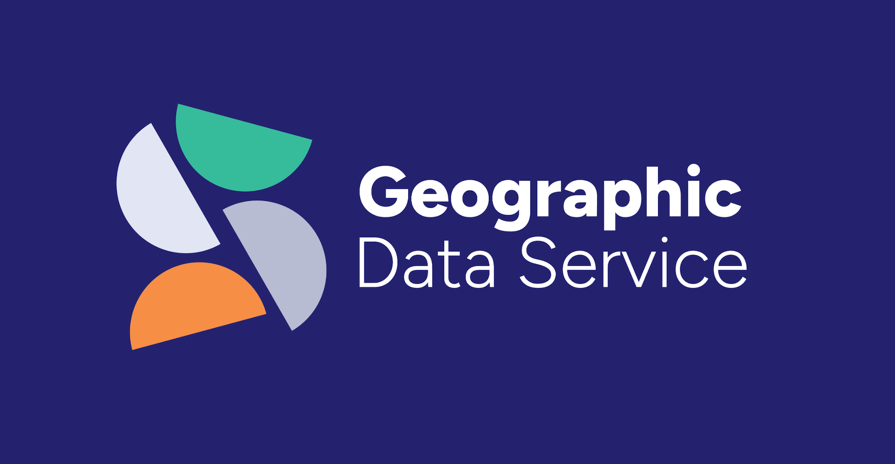

The Geographic Data Service (GeoDS)[^geods] in the UK published an article _"[Beyond the method: What the geographic information science community must do to matter][article]"_. It reports from a roundtable discussion in the House of Lords on the topic of geospatial insight and its importance. The discussion surfaced that the geospatial field is (among other things):

> "strategically undervalued, and badly in need of better connections to the people and organisations it exists to serve".

The [article][article] highlights some core insights and challenges with regards to communicating the need for geospatial information and insight. For example: 

> [M]ost data scientists in the UK are not taught to think geospatially. They are well-educated technically, but do not necessarily understand how to use spatial relationships to hold data together, or to think geographically. (...)
>
> The contention put to the room was clear: geospatial knowledge should not be a specialism. It should be an ordinary, accessible capability available to any data scientist or IT professional. That it remains confined to a relatively small professional community represents one of the most significant barriers to extracting national value from the UK’s data infrastructure. (...)
> 
> [I]f spatial is special, it has perhaps remained too special for too long. The distinctiveness that geospatial professionals have used to define and defend their field has also made it easy to exclude. When something is positioned as requiring unique expertise, unique software, and a unique intellectual tradition, the natural response from the broader data science and IT world is to step back and let the specialists handle it. The risk is that the field becomes ever more technically sophisticated and ever more institutionally isolated.

The article's author, GDS director [Alex Singleton][alex-singleton], offers this nuance: 

> I don’t fully agree with this framing, but I would argue strongly that spatial thinking is foundational, not exceptional. (...) The ambition should not be to diminish what makes spatial analysis distinctive, but to stop treating the fundamentals as guarded knowledge. (...) It requires only that spatial relationships are recognised as meaningful which is a principle, not a skill set. Until that principle is embedded in the default assumptions of data science, software engineering, and policy analysis, the value that geospatial approaches can offer will continue to depend on whether a geospatial specialist happened to be in the room.

The [article][article] goes on to highlight that the geospatial community needs to talk the language of business or government, not technology. It lists data silos and redundant data procurement as problems, advocates for trusted relationships, transparency in licensing, and legal clarity around data sharing, and highlights the opportunity of AI to make geospatial insight more accessible. The last point, of course, ties back to the need for broadening geospatial reasoning:

> If the tools themselves are becoming easier to use, then what students and professionals most need is not more software training but a stronger grounding in the core principles of Geographic Information Science (...). When anyone can run an analysis, knowing which analysis to run and why, matters more than ever.

Overall, a very interesting perspective on the geospatial field and its current challenges. I found myself nodding along to several points made in the article. Compare and contrast also with the [recent study on the Swiss geoinformation job market][study] and, if you will, with my discussion of the "spatial is special" trope in a [GEOSummit webinar][geosummit-webinar].

 [^geods]: The [Geographic Data Service or GeoDS](https://geods.ac.uk/) is a UK academic service, funded by Smart Data Research UK and operating across four universities, that leads academic collaboration with industry, government, and the third sector to extract value from smart data.

 [article]: https://geods.ac.uk/2026/02/24/beyond-the-method-what-the-geographic-information-science-community-must-do-to-matter/

 [alex-singleton]: https://alex-singleton.com/

 [geosummit-webinar]: https://digital.ebp.ch/2024/10/20/schweizer-geoinformation-2024-connecting-the-dots-perpetual-beta/

 [study]: https://spatialists.ch/posts/2026/02/23-geoinformation-job-market/