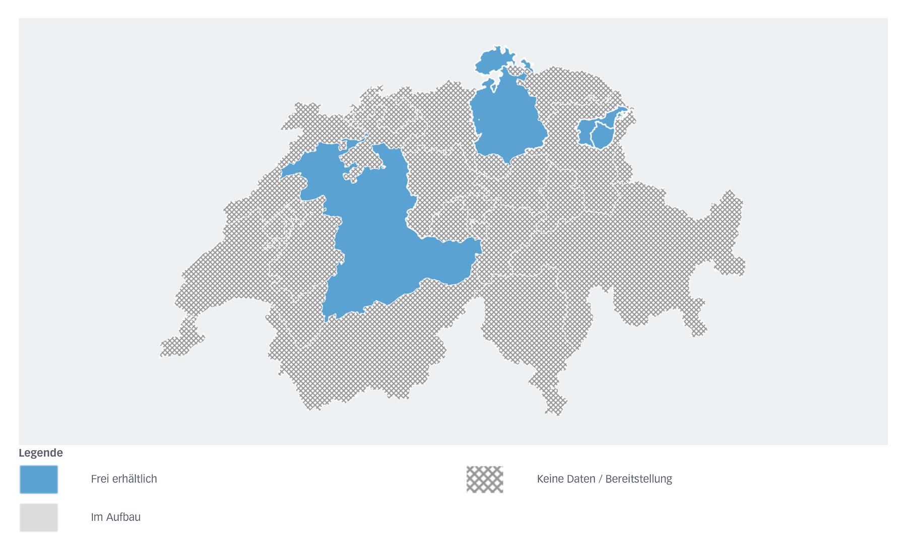

Since March, cadastral surveying data in Switzerland has been available in the
IFC[^ifc] format which is widely used for Building Information Modelling (BIM)
applications. The data can be obtained from
[geodienste.ch](https://geodienste.ch) which is operated by the KGK-CGC[^kgk-cgc].
This new feature forms part of the [4.2.3][release] release of
[geodienste.ch](https://geodienste.ch) and is labelled as an MVP[^mvp].

Based on [an announcement by the canton of Bern][announcement], the data is 
available for areas up to 1km2 and only in cantons that have explicitly granted access to their data in that format. It cannot yet be said that the feature enjoys broad support: At the time of writing, there are only 
four cantons that offer their data in the IFC format: 

- Bern
- Schaffhausen
- Appenzell Innerrhoden, and 
- Appenzell Ausserrhoden

 The data is available both in the IFC4 and the IFC4X3_ADD2 variants of the 
 IFC format. The KGK-CGC has [further information][furtherinfo] as to the 
 processing of the available data:

> When processing the data in IFC format, the parcels and land cover data from 
the official survey within the reference perimeter for which access permissions 
exist are extracted. The data is projected onto the terrain (swissALTI3D, 
swisstopo) and supplemented with existing 3D building models (swissBUILDINGS3D 
3.0 Beta, swisstopo). The objects from the official survey that have been 
cropped and exported within the reference perimeter are supplemented by 
geodienste.ch with an attribute that indicates whether the object in the 
exported data package is complete or incomplete (cropped). Processing is 
carried out using the [cs2bim][cs2bim] program.

[^kgk-cgc]: The Conference of the Cantonal Geoinformation and Cadastral Offices in Switzerland.

[^ifc]: Industry Foundation Classes, an open standard file format for Building Information Modelling (BIM) data exchange.

[^mvp]: Minimum Viable Product.

[release]: https://kgk-cgc.atlassian.net/wiki/external/YmQ3OTE0MmZlODc5NGY2N2I1MTBmYmZkYTNjZDQwYTU#4.2.3-(Release%2C-4.3.2026)

[announcement]: https://www.agi.dij.be.ch/de/start.html?newsID=4318a270-3ab2-4d83-9e24-2063f06e6143

[furtherinfo]: https://kgk-cgc.atlassian.net/wiki/external/MjVjMzM5YzVjOTljNDRjOTg4ZWViOWYwMGMwNGY0MTc#Welche-Informationen-erhalte-ich-im-IFC%3F

[cs2bim]: https://github.com/idibau/cs2bim