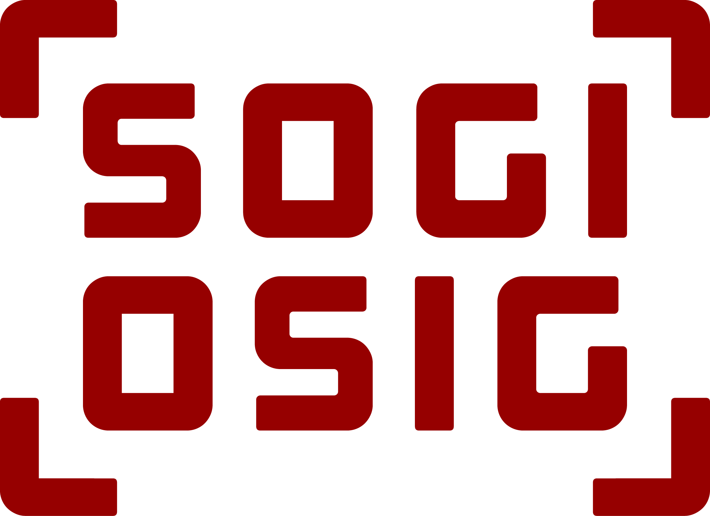

The [SOGI-OSIG][sogiosig] has started a survey on the organisation's communication activities. The survey is available [in German][survey-de] and [in French][survey-fr][^fail]. Administered by the BFH, the survey results will be used to inform SOGI-OSIG's future communication strategy and activities. It takes about 10 minutes to complete and is anonymous.

[sogiosig]: https://www.sogi.ch/

[survey-de]: https://www.geowebforum.ch/t/umfrage-sogi-kommunikation/1380

[survey-fr]: https://www.geowebforum.ch/t/enquete-sur-la-communication-osig/1381

[^fail]: A defect of the outreach was that, [initially, the survey was only available in German](https://www.geowebforum.ch/t/umfrage-sogi-kommunikation/1380/2). This does reflect my perception of the focus of the organisation and its main event, the [GEOSummit](https://www.geosummit.ch/). To me, it seems the Suisse romande, i.e. the French-speaking part of Switzerland, is under-represented in the SOGI-OSIG and has built their own community and events such as the [Journée romande de la géoinformation](https://georomandie.com/).

