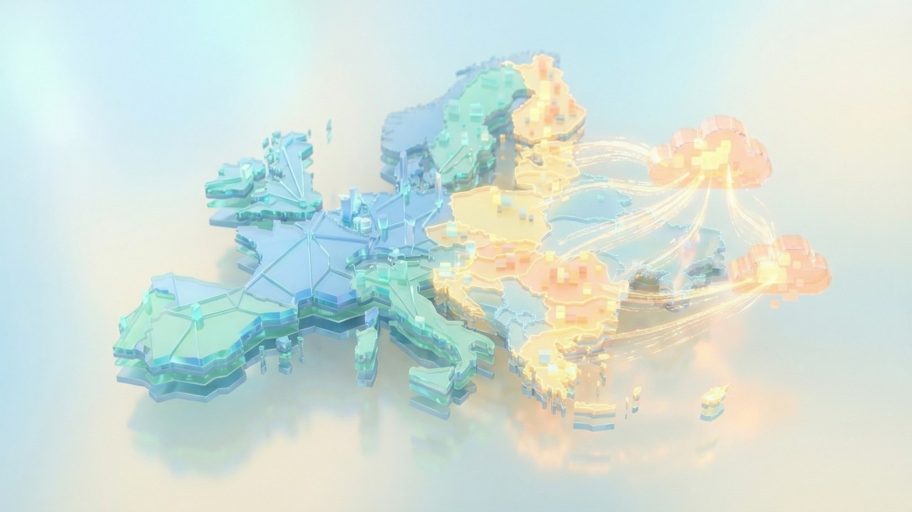
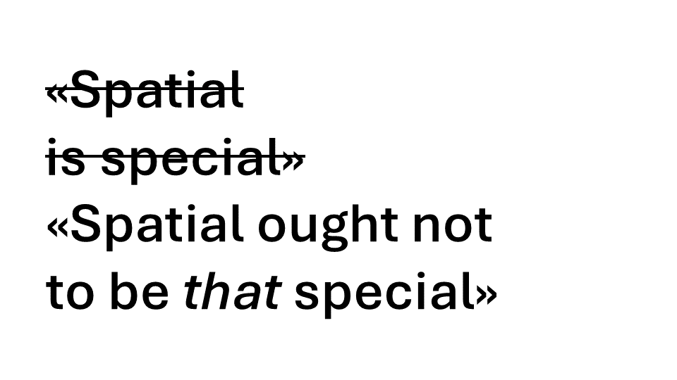

INSPIRE[^inspire] is an initiative by the European Commission to create a 
European SDI[^sdi] to support EU policy. It is based on
the directive 2007/2/EC of the European Parliament and of the European Council 
which was put into force in May 2007[^parallels]. As [announced in December][announcement], under the banner of [reducing administrative burden][burden] within the EU, the INSPIRE directive is set to be simplified.

[Javier de la Torre][javier], founder and chief strategy officer of CARTO and 
member of the board of directors of the OGC[^ogc], published a very interesting 
[article][article] on this development. The article also 
covers some INSPIRE history for those who are not very familiar with this 
European initiative: 

> When INSPIRE launched in 2007, it was genuinely ambitious. A legal framework 
to make environmental and geospatial data discoverable, accessible, and 
interoperable across 27 member states. Nothing like it existed in any other 
industry.
> 
> And that's both its legacy and its problem. INSPIRE pushed the geospatial 
world to publish data in more structured and interoperable ways than almost any 
other sector. That was remarkable. 

This is what made "geo" an easy and early supplier of data for the open data movement and OGD[^ogd] initiatives. Standards for data, metadata, and interfaces were in place.

But Javier goes on: 

> But [the geospatial world] did [publish data in more structured and interoperable ways than almost any 
other sector] before the broader analytics 
industry had caught up. (...) So the geospatial community built its own 
interoperability stack: ISO 191xx models, GML application schemas, WFS 
services, custom XML encodings.

This reminds me of the "capital-GEO" view of geospatial, that is, the perception of (or indeed the concrete idea to *spell* things) "GEOdata", "GEOinformation", etc., which I think is ill-advised.[^talk]

Javier continues: 

> INSPIRE inherited that same DNA. It became a compliance exercise built on 
standards that were technically sound but practically hard to implement, hard 
to follow, and often badly followed. In some cases, the effort to comply with 
INSPIRE actually made geospatial data harder to use for anyone outside the 
traditional GIS world.

Javier argues that while some industry stakeholders view the simplification of 
INSPIRE as a threat and as abandoning interoperability, it is actually an 
opportunity to build a more broadly useful data ecosystem:

> For decades, geospatial interoperability meant creating specialized standards 
that only the geospatial community used. Custom schemas, custom encodings, 
custom services. The result was a data silo, not because of proprietary 
software, but because of isolated standards.
> 
> If we want spatial data to actually power AI, climate modeling, mobility 
optimization, biodiversity monitoring, and resilience planning, it needs to 
live where analytics happens. (...) That means formats the broader data 
industry already uses. Formats like GeoParquet. Open table standards like 
Apache Iceberg. API-driven access. Columnar storage. Cloud-native architectures.
> 
> These aren't "GIS standards." They're analytics standards. And that's 
precisely the point. The future of geospatial interoperability is not inventing 
new specifications for our community. It's adopting the ones the rest of the 
data world already uses. That's how you make spatial data a first-class citizen 
in the modern data stack, not by isolating it behind bespoke encodings that 
require specialized tooling to read.

Lower-case "geo", at last. 

I feel tempted to quote even more from Javier's post; there are [many more good points in it][article], so definitely give it a read.

[article]: https://www.linkedin.com/pulse/inspire-early-now-its-time-converge-javier-de-la-torre-jecse/

[^inspire]: [Infrastructure for Spatial Information in the European Community](https://knowledge-base.inspire.ec.europa.eu/index_en).

[^sdi]: Spatial Data Infrastructure.

[^parallels]: Parallels: The Swiss Federal Act on Geoinformation was put into force in July 2008.

[announcement]: https://knowledge-base.inspire.ec.europa.eu/news-and-publications/news/simplification-inspire-directive-2025-12-10_en

[burden]: https://environment.ec.europa.eu/publications/simplification-administrative-burdens-environmental-legislation_en

[javier]: https://www.linkedin.com/in/jatorre/

[^ogc]: Open Geospatial Consortium.

[^ogd]: Open Government Data: The movement or policy of the public sector to publish their data openly.

[^talk]: I have talked about this in more detail in an (irony!) *GEOSummit* webinar that congealed into [this blogpost](https://digital.ebp.ch/2024/10/20/schweizer-geoinformation-2024-connecting-the-dots-perpetual-beta/). 
The "GEO" part is about halfway through.
