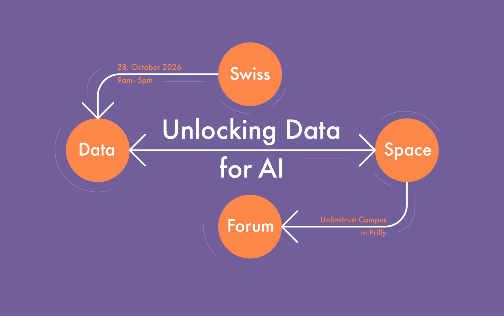

The Swiss Data Space Forum [just announced itself][announcement] 
to the world[^world]: 

> Follow us to stay updated and join a community shaping the 
future of data spaces in Switzerland and beyond.

Per the 2025 Swiss Data Alliance study, geodata can (should?) 
serve as a basis for trustworthy Swiss data spaces – a "horizontal" 
for the various verticals, if you will. The study is available 
online ([in German][study-de], [in French][study-fr]) from the 
Federal Chancellery. See also [Alain Buogo][alain]'s[^alain] 
article on the topic, for more context, [in German][article-de] 
and [in French][article-fr].

In any case, it is probably worth following the Swiss Data Space 
Forum if you are more broadly interested in data – *sans "geo"* – 
politics and infrastructure in Switzerland and beyond. If you want 
to dive even deeper and/or learn about the Forum (the fall event 
around data spaces), you can find my[^transp] review (in German) 
of the 2025 event [here][data-spaces-geo].

[announcement]: https://www.linkedin.com/posts/%F0%9D%97%9B%F0%9D%97%B2%F0%9D%97%B9%F0%9D%97%B9%F0%9D%97%BC-%F0%9D%97%AA%F0%9D%97%BC%F0%9D%97%BF%F0%9D%97%B9%F0%9D%97%B1-welcome-to-share-7444702531420729344-3QgQ

[^world]: The world in question being the LinkedIn community.

[data-spaces-geo]: https://www.linkedin.com/posts/alainbuogo_dataspaces-digitalswitzerland-ejustice-activity-7425823186249760768-O0uF

[study-de]: https://www.bk.admin.ch/bk/de/home/digitale-transformation-ikt-lenkung/datenoekosystem_schweiz/prototypen/swisstopo.html

[study-fr]: https://www.bk.admin.ch/bk/fr/home/digitale-transformation-ikt-lenkung/datenoekosystem_schweiz/prototypen/swisstopo.html

[alain]: https://www.linkedin.com/in/alainbuogo/

[^alain]: Deputy Director of swisstopo and Head of the Coordination, Geo-Information and Services Division.

[article-de]: https://www.netzwoche.ch/news/2025-05-19/geodaten-als-basis-fuer-vertrauenswuerdige-datenraeume

[article-fr]: https://www.ictjournal.ch/articles/2025-05-23/les-geodonnees-comme-base-pour-des-espaces-de-donnees-fiables-0

[data-spaces-geo]: https://digital.ebp.ch/2025/09/09/rueckblick-aufs-swiss-data-spaces-forum-2025/

[^transp]: Obvious transparency note here.