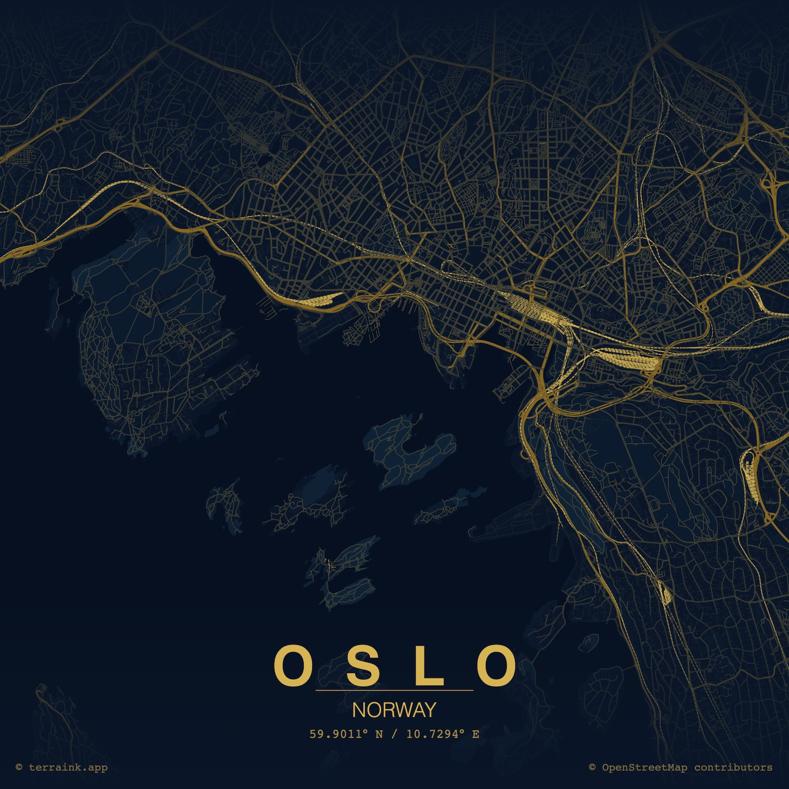
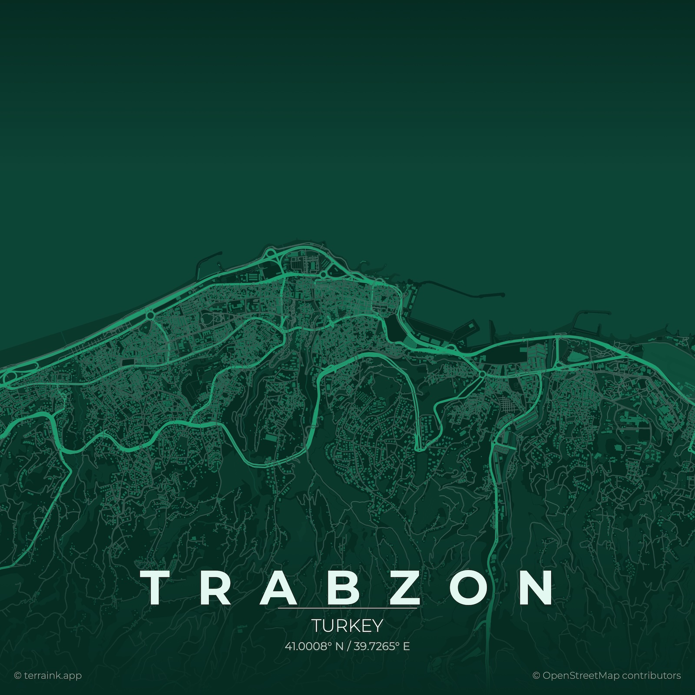
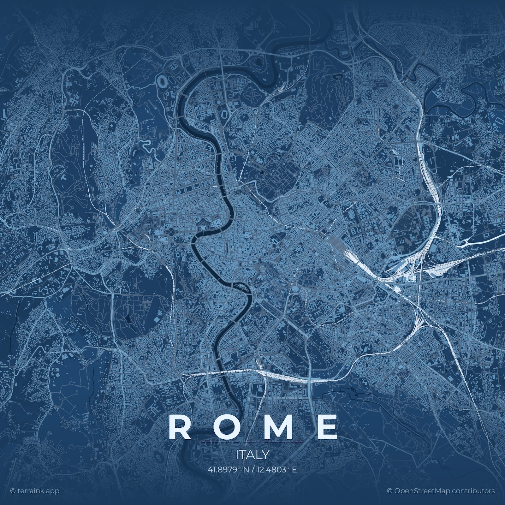

[Terraink][terraink] (tagline: *The cartographic poster engine*) is a 
sophisticated web app for producing artistic OSM-based[^osm] maps. There are 
many such tools, but [Terraink][terraink] stands out for the breadth of its 
customisation options and the quality of its output.

Users can choose from: 

- a variety of colour themes
- more than twenty layouts (for example, different paper sizes or images for 
various social networks) or create a custom one
- a selection of fonts and toggle various elements on or off
- seven OSM layers
- and add their own markers if the want to.

The [app][terraink] is created by Yousuf Amanuel, based in Hanover, Germany. It 
is free to use (but note the [ko-fi link](https://ko-fi.com/yousifamanuel)) and 
[open-source][github] under the AGPL-3.0 License. 

Recommended for anyone looking to create unique maps for print or social media.

[^osm]: [OpenStreetMap](https://www.openstreetmap.org/), a collaborative, open-licensed map of the world.

[terraink]: https://terraink.app/
[github]: https://github.com/yousifamanuel/terraink