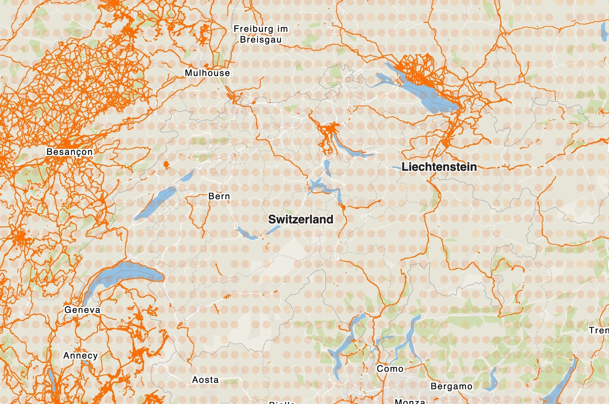

I learned a bit obliquely about Panoramax from [this interview with Christian 
Quest][interview] on the [OpenCage Blog][blog]. [Panoramax][panoramax] is a 
project to create a collection of freely accessible and reusable photographs of 
places visible from public space.[^comparison] [Currently][stats], the project 
hosts over 100 million geolocated pictures, contributed by over 2,000 
participants and covering over 900,000 km of road.

Panoramax started in 2022 in France. Remarkably (to me), as a collaboration 
between the French national mapping agency and the French OSM commmunity as
Christian explains in the [interview][interview]:

> Panoramax is a project that started in 2022. OpenStreetMap France proposed to
IGN[^ign] to work together to build an open source, collaborative, decentralized and
federated way of sharing ground level imagery. 

")

Now, the initiative seeks to form the Panoramax Foundation (scheduled for this 
August), which will be a non-profit organization to support the project and 
also its growth outside of France. Christian:

> The OSM foundation is a source of inspiration, mainly on its light approach. 
OSMF takes care of the very core things (the main database, some basic services 
on top of it, and tools for the contributors), letting an ecosystem and local 
chapters build on that core to provide many additional services around OSM data.
> 
> I think the Panoramax foundation should also take care of the core of the 
project, like the meta-catalog that is federating the autonomous local 
Panoramax instances and some shared tools for contributors or to help set up 
new Panoramax instances. Another thing the Panoramax foundation should take 
care [of] is the coordination of the actual software stack development. This does 
not mean the foundation will do all developments, but it should make sure they 
fit a shared goal for the emerging Panoramax ecosystem.

The [Panoramax website][panoramax] has an [FAQ (that also addresses legal 
questions), contributor's guide, tutorial and technical documentation][docs], 
[example use cases][cases], and, of course, the [access to the data itself][map]. 

Interesting origin story, with the open and governmental cooperation. And open 
data is always valuable and also in the interest of digital sovereignty. I'd 
like to see the project to (continue to) grow beyond France.

Update: Simon Poole [pointed out](https://en.osm.town/@simon/116504812795210693) 
interesting and relevant context for Switzerland.

[interview]: https://blog.opencagedata.com/post/openstreetmap-interview-panoramax
[blog]: https://blog.opencagedata.com
[panoramax]: https://panoramax.fr
[stats]: https://panoramax.fr/stats
[docs]: https://panoramax.fr/foire-aux-questions
[cases]: https://panoramax.fr/cas-d-usage
[map]: https://api.panoramax.xyz/?focus=map&map=0.95/0/-0.6&speed=250&users=default

[^comparison]: Think of something like Mapillary or Google Street View, but
with strong emphasis on open data and reuse.

[^ign]: France's National Mapping Agency, the Institut national de l'information géographique et forestière.

