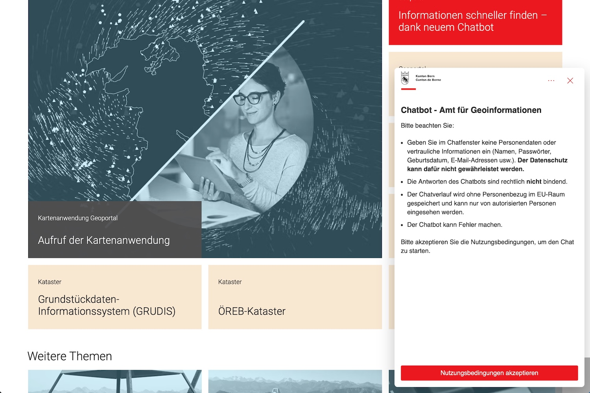

The canton of Berne has launched a chatbot to provide visitors of their 
geoinformation portal and website access to information about cantonal geodata. 
From the announcement ([in German][news-de] / [in French][news-fr]): 

> The chatbot provides quick and easy answers to your questions – whether you 
need help navigating the website, searching for specific geodata, or 
interpreting geometadata. The chatbot helps you find the information you need 
more quickly.

Note, this is not (yet?) a "talk to the map" solution, but a chatbot that can 
answer questions about the website and available data[^py]. If I read the 
announcement right, the chatbot probably has access to all 
geoinformation-related web content as well as to the metadata[^metadata] of all 
cantonal geodata.

In my quick tests, the chatbot can answer questions posed in German, French, 
and in English (and likely many more languages; Turkish also worked okay, for 
example):

- *"Welche Layer gibt es zu Wald?"*
- *"Vous avez les données RDPPF?"*
- *"What groundwater data do you have?"*

A question in English yielded a German answer, for me. With German 
and French, the language of the answer mirrors the language of the question.

[news-de]: https://www.agi.dij.be.ch/de/start.html?newsID=76357bba-a52d-415c-821d-b69b06c59bcc
[news-fr]: https://www.agi.dij.be.ch/fr/start.html?newsID=76357bba-a52d-415c-821d-b69b06c59bcc

[^metadata]: I will never call this "geometadata"."
[^py]: And my standard test: If coaxed a little, the bot will also help solve a 
simple Python problem.