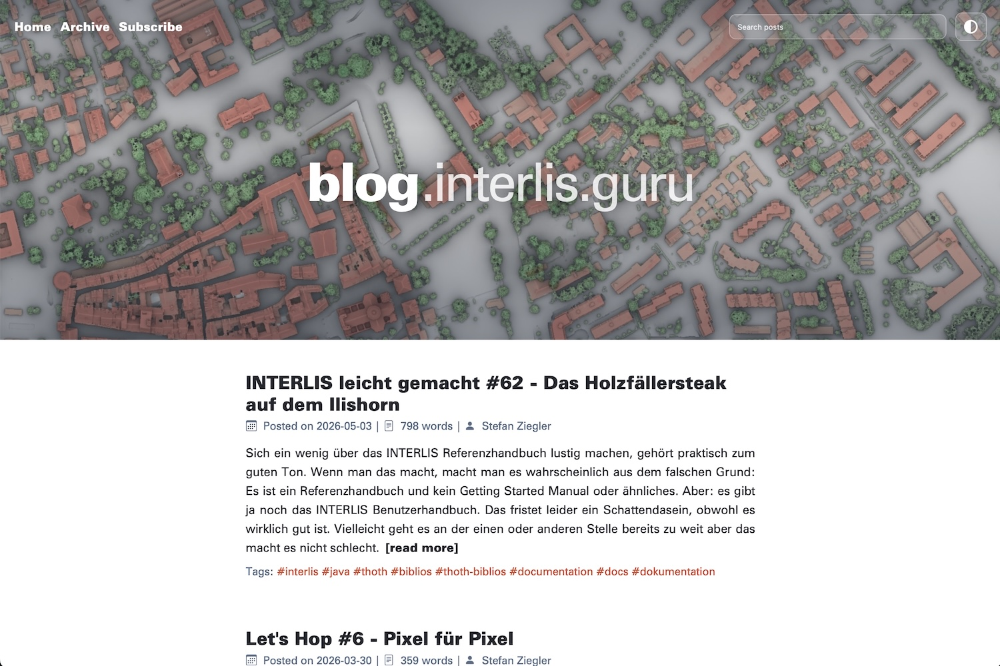

Stefan Ziegler, head of the Office of Geoinformation of the canton of Solothurn, 
has been blogging for 12 years at [blog.sogeo.services](https://blog.sogeo.services). 
Now Stefan's blog -- I would say, *the* premier outlet for INTERLIS[^interlis] 
content (among other topics[^topics]) -- has a new home: 
[blog.interlis.guru][blog]. 

If you use RSS, point your feed reader to [`blog.interlis.guru/feed.xml`][rss].

[^interlis]: [INTERLIS](https://www.interlis.ch/en) is a Swiss standard for 
geodata modelling and data exchange.
[^topics]: Besides INTELRIS, the blog has covered Apache Hop, AI and MCP, 
ÖREB/RDPP services, ETL, and more.

[blog]: https://blog.interlis.guru
[rss]: https://blog.interlis.guru/feed.xml
