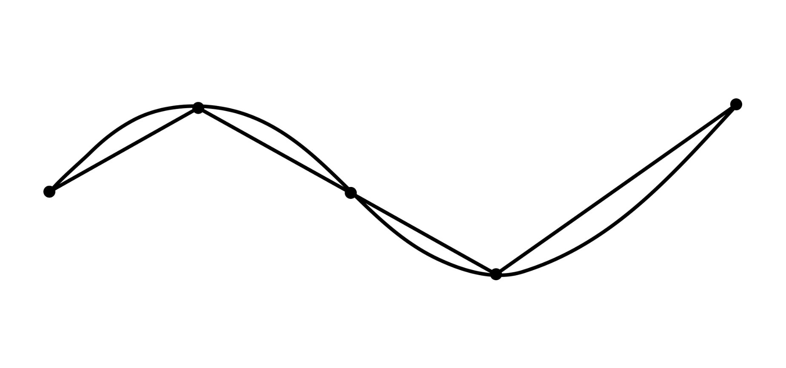

Maybe you have encountered the [coastline paradox][coastline-paradox] before. It basically states that a coastline appears longer the more finely you measure it. In other words, the length of a coastline is not well-defined, 
but scale-dependent. 

I vividly remember reading about this phenomenon for the first time in a section 
about [fractal dimensions][fractal-dimension][^space-filling] in O'Sullivan and Unwin's *"Geographic 
Information Analysis"* ^[Recommended!] during my studies. 

Now, the BBC have an [in-depth and very interesting article][article] about the 
phenomenon. I learned quite some new aspects about this paradox, among others 
who encountered and documented it for the first time and why. [Interesting 
stuff][article]!

[^space-filling]: Another concept that tends to show up in this context is that 
of [space-filling curves](https://en.wikipedia.org/wiki/Space-filling_curve), 
such as the [Hilbert curve](https://en.wikipedia.org/wiki/Hilbert_curve), 
often used in spatial indexing. It's all connected!

[coastline-paradox]: https://www.britannica.com/science/coastline-paradox
[fractal-dimension]: https://en.wikipedia.org/wiki/Fractal_dimension
[article]: https://www.bbc.com/travel/article/20260410-why-its-impossible-to-measure-englands-coastline