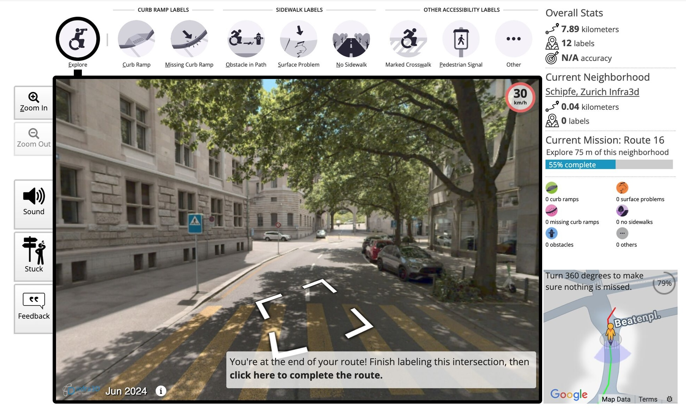

[ZuReach][zureach] (short for "Zurich Urban Reachability & Accessibility 
Enhancement Through Digital Technology") is a participatory research project 
that aims to improve accessibility in the city of Zurich, especially for people 
with mobility restrictions, through crowdsourcing. It builds on the earlier 
[ZuriACT][zuriact] (Zurich Accessible City) project that enriched data on 
sidewalk acessibility for district 1 of the city. ZuReach's goal is to build a 
collection of comprehensive sidewalk accessibility data in Zurich by involving 
citizens in the process of data collection.

Now, the ZuReach project, together with [Project Sidewalk][sidewalk], 
[iNovitas][inovitas] and the [City of Zurich][zurich] launches a new web 
application for urban accessibility data collection. The application allows 
citizens to contribute to the mapping of urban accessibility features, such as 
pavement surface issues, marked crosswalks, pedestrian signals, obstacles, curb 
ramps, and more, by providing an easy-to-use interface for data submission. 
High-resolution street view imagery by iNovitas is incorporated into the 
application, allowing users to virtually explore the city and identify 
accessibility issues. 

](zureach-2.jpg "... Project Sidewalk")

Currently, the team is seeking support from volunteers to scale accessibility 
data collection citywide in Zurich and also in Winterthur. Besides data 
collection, the team also is also looking for participants for formative 
research, including interviews, focus groups, and surveys). More information can 
be found in this [announcement][announcement] on LinkedIn, in the [call for 
participants](https://www.geo.uzh.ch/en/units/gis/research/zureach/news/registration.html), 
or directly in the [registration form](https://www.uzh.ch/zi/cl/surveys/index.php/174274).

ZuReach is funded by the [Digitalization Initiative of the Zurich Higher 
Education Institutions][dizh] (DIZH) and led by the [Digital Society 
Initiative][dsi] at the University of Zurich, in collaboration with the [City of 
Zurich][zurich], the [Zurich University of Applied Sciences][zhaw] (ZHAW), the 
[UZH Healthy Longevity Center][longevity], and other partners. 

The [Project Sidewalk software][repo] is open source under the MIT License. The 
repository's "getting started" guide also lists some [more Project sidewalk 
deployments](https://github.com/ProjectSidewalk/SidewalkWebpage/wiki#example-deployments) 
in the USA, Canada, the Netherlands, Mexico, and Taiwan.

[zureach]: https://www.geo.uzh.ch/en/units/gis/research/zureach.html
[dizh]: https://www.dizh.uzh.ch/
[dsi]: https://dsi.uzh.ch/
[longevity]: https://www.hlc.uzh.ch/en.html
[zuriact]: https://www.geo.uzh.ch/en/units/gis/research/ZuriACT_en.html
[sidewalk]: https://sidewalk-chicago.cs.washington.edu/
[inovitas]: http://www.inovitas.ch/
[zurich]: https://www.stadt-zuerich.ch/
[announcement]: https://www.linkedin.com/posts/hoda-bakhshi-999a1a33_urbanmobility-accessibility-communityscience-activity-7468337484737908736-TYQY
[repo]: https://github.com/ProjectSidewalk/SidewalkWebpage
[zhaw]: https://www.zhaw.ch/