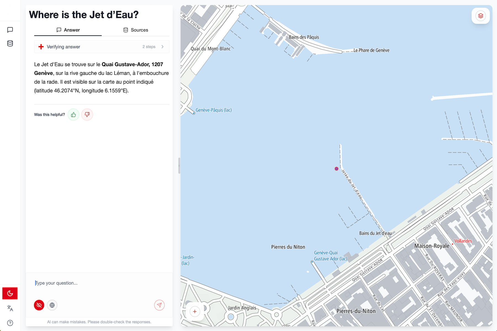

Under the title *"[GeoForge Geneva][geoforge]"*, the Geneva Département du
Territoire launches a public experiment around a "talk to the map" AI[^ai] 
solution. I know of several cantons who test similar solutions internally or
semi-publically, but Geneva is the only example I'm aware of that runs a
*public* test period. Also unlike the other cantonal tests I'm aware of, Geneva
is testing the solution by Lausanne-based [Ageospatial][ageospatial].

During onboarding, [GeoForge][geoforge] asks you to pick your age range, 
professional sector, and further asks you to provide feedback on GeoForge 
results and user experience. The interface supports French, German, and English.

[][geoforge]

The test instance can be accessed [here][geoforge] (using a *desktop* browser). 
Some more information on the test can be found in the SITG[^sitg] [announcement 
on LinkedIn][announcement].

[geoforge]: https://geoforge.sitg-lab.ch/
[ageospatial]: https://ageospatial.com/
[announcement]: https://www.linkedin.com/posts/sitg-geneve_innovationpublique-ia-geneve-activity-7465265557769084928-R6iP

[^ai]: Artificial intelligence
[^geoai]: Specifically, the application of AI on geospatial data and for answering spatial questions.
[^sitg]: [Système d'Information du Territoire à Genève](https://sitg.ge.ch/).