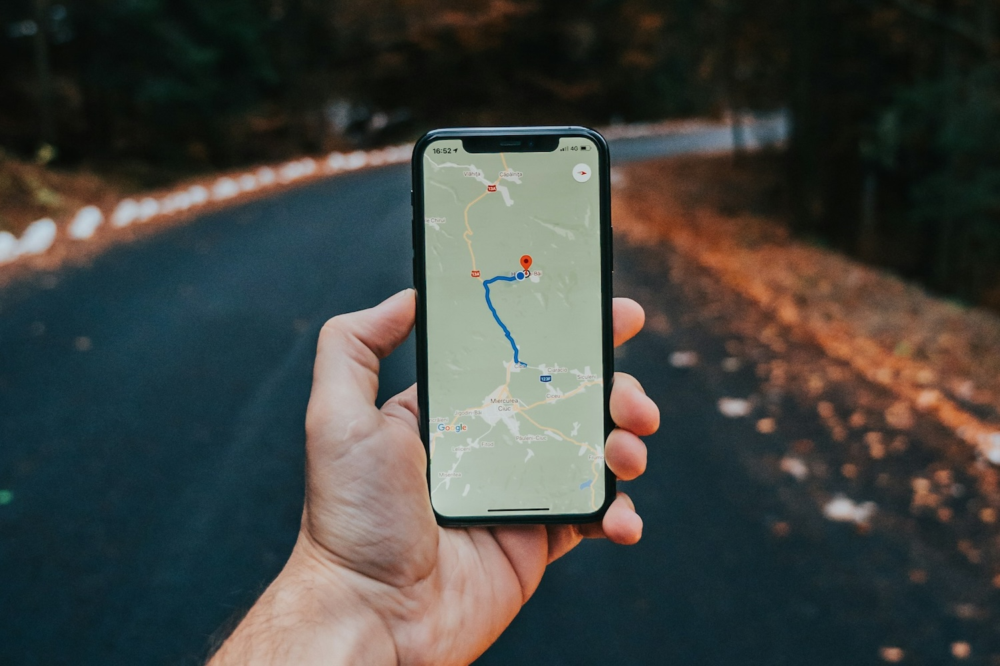

I couldn't find conclusive evidence about this supposed phenomenon, but there is "anecdata"[^anecdata] that
Google Maps data may have worsened, at least in some parts of the world, over the last few months: 

- [Google Maps is getting worse](https://www.reddit.com/r/GoogleMaps/comments/1oylitv/google_maps_is_getting_worse/)
- [AI ruined Maps FOREVER!](https://www.reddit.com/r/GoogleMaps/comments/1syqllz/ai_ruined_maps_forever/)
- [Did the algorithm of Google Maps change? It's so unreliable now](https://support.google.com/maps/thread/430263313/did-the-algorithm-of-google-maps-change-it-s-so-unreliable-now?hl=en)
- [Is Google Maps losing its way?](https://www.linkedin.com/posts/hosangadi_google-googlemaps-ai-share-7289239320278818816-zLYp/)

My^[Admittedly: brief.] search was triggered by a LinkedIn article written by [Helmut 
Barz](https://www.linkedin.com/in/helmutbarz/): *[When the algorithm suggests free fall: The 
enshittification of Google Maps][article]*. Helmut lists some examples from his experience as well 
as some cases of bad navigation (data or functionality) that made headlines:

> It used to be different. For more than a decade, Google Maps was my personal gold standard of 
navigation across Europe and the US. But lately, the system’s failures are piling up, and we are 
long past the point of funny anecdotes.

Helmut attributes this to the process of enshittification[^enshittification] and a shift from painstakinlgy collected
ground truth to stronger reliance on data derived from satellite imagery using AI or GeoAI[^geoai]. From
Helmut's [post][article]: 

> The focus today is on paying logistics companies, Uber drivers, delivery services, and urban 
agglomerations. That is where the ad money flows, and where data harvesting is lucrative. If you 
live in the countryside, drive a camper outside the metropolises, or seek nature on a bicycle, you 
fall through the cracks. Rural areas are becoming victims of “digital redlining” — they are 
degenerating into data deserts.
> 
> The most cynical part? We, the users, made Google Maps great. We fed the map for years with 
Point-of-Interest (POI) data, photos of restaurants, and hazard warnings for free. Now, the very 
community that built the system’s wealth is being abandoned.

The [article][article] goes on to point to some alternatives: (Google-owned) Waze for car navigation 
and Komoot for cycling. On that latter platform, however: The popular sports planning platform 
Komoot has been sold to private equity last year. In his article *[When we get Komooted][article2]*, 
Josh Meissner gives an insightful account of the sale of Komoot and the often disappointing 
mechanics behind similar community-powered services.

My main take-away from the first post is the data politics perspective offered by Helmut: 

> But the medium and long-term solution must be to reclaim geographic data as a decentralized public
good. (...) It’s time to stop feeding free data to a system that wants to send us — literally and 
metaphorically — over a cliff. Let's rather put our data where our interest is — and use it for the 
common good.

I would add as another pillar: official data, sustainably, responsibly, and transparently collected 
in guaranteed homogeneous and suitably high quality.

[article]: https://www.linkedin.com/pulse/when-algorithm-suggests-free-fall-enshittification-google-helmut-barz-2vybe/
[article2]: https://bikepacking.com/plog/when-we-get-komooted/

[^anecdata]: [Anecdotal evidence.](https://en.wikipedia.org/wiki/Anecdotal_evidence#Scientific_context)
[^enshittification]: "Enshittification" is a term coined by writer [Cory Doctorow](https://en.wikipedia.org/wiki/Cory_Doctorow) for the mechanisms prevalent specifically in two-sided online platforms and services. Think, for example, web search which serves two sides of the market with -- often -- conflicting interests, namely the (end-)users and (enshittification says: over time, more and more) the advertising customers.
[^geoai]: The application of AI on geospatial data and for answering spatial questions.
