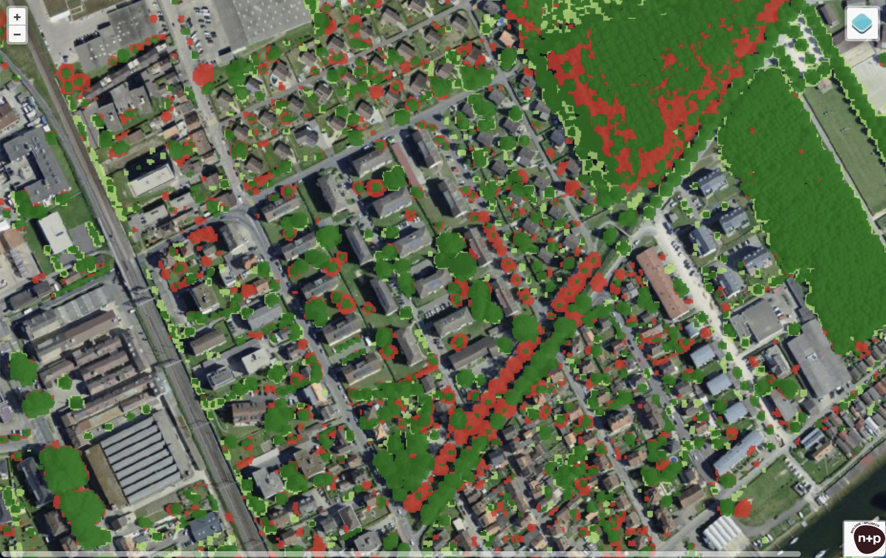
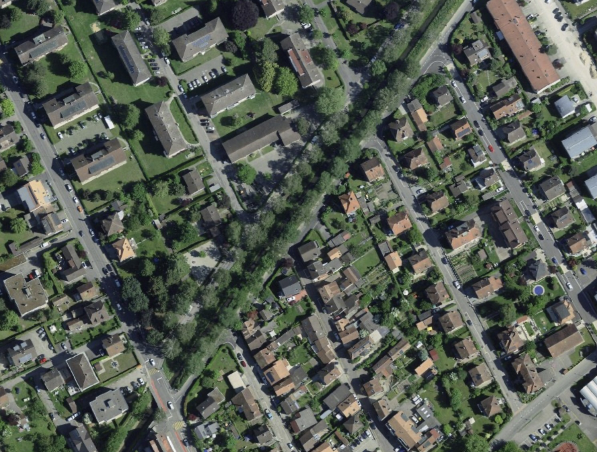
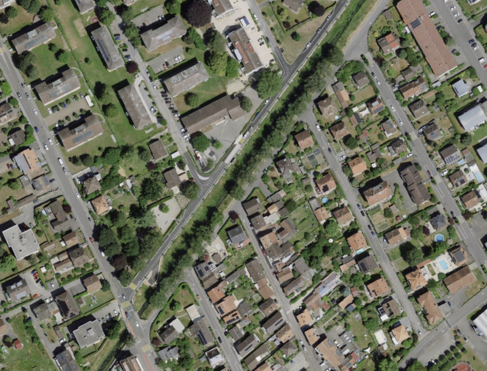
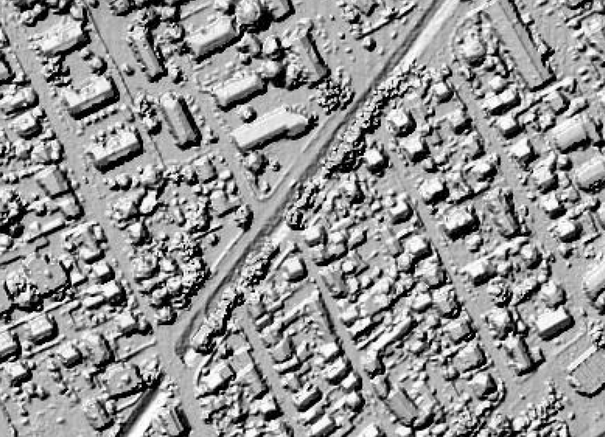

The environmental engineering firm [n+p][nandp] has conducted an interesting 
analysis of tree cover changes in the Swiss canton of Vaud: They detected tree 
canopies in [swisstopo][lidar][^swisstopo][&nbsp;LiDAR][lidar][^lidar][&nbsp;data][lidar] from 2019 and from 2025 and computed 
the difference using QGIS and Python. From their [announcement][announcement]:

> n+p has used this data to develop a tool that tracks changes in tree cover in 
> built-up areas: residential neighbourhoods, town centres and business parks.
> 
> In practical terms, it is now possible to determine, sector by sector, whether 
> tree cover has been maintained or lost, and whether new trees have grown or 
> been planted between 2019 and 2025.

The results can be viewed using a [simple web app][app] (full-screen version 
[here][fullscreen]) that shows either hex-binned changes or the "precise" 
changes (as much as the data allows), depending on the zoom level:

[][fullscreen]

The analysis has an interesting wrinkle, however, as an employee of the 
Direction du Cadastre et de la Géoinformation of the canton of Vaud [pointed 
out on LinkedIn][comment]: Apparently, unlike the canton's 2019 LiDAR data the 
2025 data was obtained in winter at the turn of the year from 2024 to 2025, "in 
order to optimise the quality of the digital terrain model and not the study of 
the canopy". 

Still, the trees (trunks and branches) show plenty of LiDAR returns also in 
their leafless state. While I wouldn't trust volumetric analyses based on this 
data, to me, after some checks the analysis still seems to hold plenty of 
signal.[^errors] The [map by n+p][app] is actually helpful to spot-check the 
quality of the results, since it also displays orthophotos from both 2025 and 
2019. In the below images you can see the row of street trees visible in the 
lower right quadrant of the above screenshot. Between 2019 and 2025, clearly, 
one row of trees was cut down.

And here is approximately the same area in the LiDAR data as used by n+p and as 
viewed in the swisstopo viewer ([2019][2019] and [2025][2025]):

![LiDAR DTM^[Digital terrain model.] in 2019](lidar-2019.jpg "LiDAR DTM in 2019")

All in all an interesting quick analysis. We are likely to see more such 
investigations in the future, in the face of climate change and rising 
temperatures, especially in urban areas.

[nandp]: https://nplusp.ch/
[lidar]: https://www.swisstopo.admin.ch/en/height-model-swisssurface3d
[announcement]: https://www.instagram.com/p/DaSk_Yes_Bd/
[app]: https://canopee.nplusp.ch/
[fullscreen]: https://canopee.nplusp.ch/websig/index.php
[comment]: https://www.linkedin.com/feed/update/urn:li:activity:7478424446324850688/?dashCommentUrn=urn%3Ali%3Afsd_comment%3A%287480578209118355457%2Curn%3Ali%3Aactivity%3A7478424446324850688%29
[2019]: https://map.geo.admin.ch/#/map?lang=en&center=2538733.78,1182175.55&z=11.185&topic=ech&layers=ch.bafu.landesforstinventar-vegetationshoehenmodell_relief@year=2019&bgLayer=ch.swisstopo.pixelkarte-farbe
[2025]: https://map.geo.admin.ch/#/map?lang=en&center=2538733.78,1182175.55&z=11.185&topic=ech&layers=ch.bafu.landesforstinventar-vegetationshoehenmodell_relief@year=current&bgLayer=ch.swisstopo.pixelkarte-farbe

[^swisstopo]: The Federal Office of Topography of Switzerland.
[^lidar]: Light Detection and Ranging, an active remote sensing technique that uses laser pulses to generate 3D point clouds of the Earth's surface or objects.
[^errors]: I found an obvious error in the analysis [here](https://map.geo.admin.ch/#/map?lang=en&center=2539159.51,1182148.81&z=11.484&topic=ech&layers=ch.bafu.landesforstinventar-vegetationshoehenmodell_relief@year=current&bgLayer=ch.swisstopo.pixelkarte-farbe), for example (linking to swisstopo's map viewer, since the n+p map doesn't URL-encode the viewport).