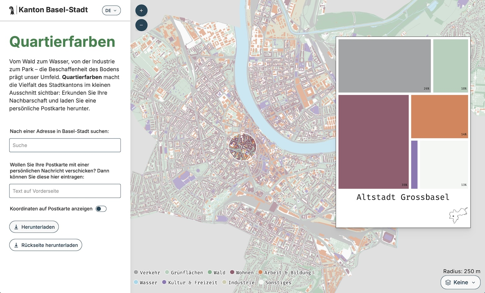

The Statistical Office of the Canton Basel-Stadt published a visualisation of 
the landcover of the city's neighbourhoods. Termed "Quartierfarben" 
(German for "neighbourhood colours"), the project is grounded rather in art than 
in scientific data visualisation, but not a bit less intriguing for it. The "Quartierfarben" are published as an [interactive web app][app] and as a piece 
in a [printed magazine "Dossier Basel"][magazine][^magazine] and its [pdf 
version][pdf].

[][app]

The "Quartierfarben" distinguish traffic, green areas, forest, residential 
areas, work & education areas, water, culture & leisure areas, industrial areas 
and other landcover types. The [web app][app] allows you to explore the 
landcover of the different neighbourhoods of Basel interactively and then to 
create (and download, not send) a postcard for a location of your choosing. I 
find this a very neat approach to make (sometimes quite abstract) data 
explorable and eventually tangible.

)](quartierfarben-postcard.jpg "Quartierfarben as a postcard (source: Emphase)") 

The whole project builds on (and extends) "[Grätzlfarben][graetzlfarben]" (by 
the Technical University of Vienna) and "[Kiezcolors][kiezcolors]" (by ODIS 
Berlin) which have done a similar analysis and visualisation for Vienna and 
Berlin, respectively. The code for the "Quartierfarben" is open-source under 
the MIT license on [GitHub][repo].

[app]: https://statistik.bs.ch/quartierfarben/
[post]: https://emphase.ch/en/projects/magazin-dossier-basel
[magazine]: https://emphase.ch/en/projects/magazin-dossier-basel
[pdf]: https://statistik.bs.ch/files/dossiers/141-2604.pdf
[graetzlfarben]: https://cartolab.at/graetzlfarben/#13/48.20996/16.3704
[kiezcolors]: https://kiezcolors.odis-berlin.de/#13/52.49899/13.3915
[repo]: https://github.com/statabs/quartierfarben

[^magazine]: Minuscule footnote: Oddly (to me), this magazine of the 
Statistical Office is sold / has a paid subscription. This reminds me of an 
event organised by the office that also charged an entry fee, which surprised me 
a lot from a cantonal institution.