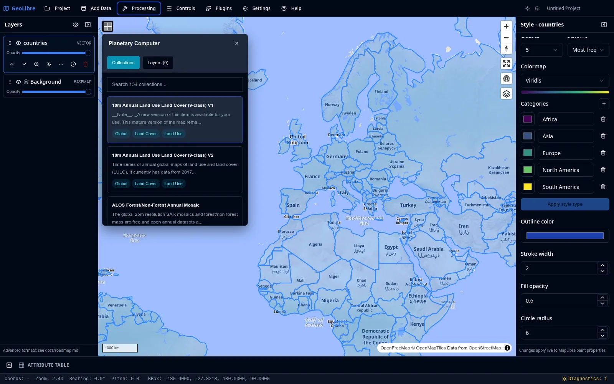

[GeoLibre][geolibre] – "a free and open-source, lightweight, cloud-native GIS 
platform for visualizing, exploring, and analyzing geospatial data" – has 
reached version 2.0.0 (and since 19 hours already 2.1.0, actually[^firstversion]). 

GeoLibre can run in the browser (all data stays local), as a desktop app (using 
[Tauri][tauri]), on Android (same), and [embedded as a Python package][embedded] 
inside [Jupyter][jupyter]. GeoLibre features include:

- Multi-view workspace of synchronised maps with basemaps from several providers
- CesiumJS 3D globe view, camera-synced with 2D maps (this requires a Cesium Ion 
token)
- Vector layer support through  DuckDB[^duckdb]-WASM Spatial, including formats such as
GeoJSON, GeoParquet, GeoPackage, FlatGeobuf, KML/KMZ, GML, GPX, 
OSM[^osm] PBF extracts, and more
- Support for XYZ tiles, WMS and WFS, vector tiles, COG, GeoTIFF, MBTiles, 
ArcGIS FeatureServer and VectorTileServer layers, PMTiles, Zarr, 3D Tiles, 
ArcGIS I3S scene layers, DXF/DWG, Gaussian splats, glTF/GLB 3D models, and more
- Styling single, categorized, graduated, expression, and rule-based symbology, 
proportional symbols, fill patterns, built-in marker library, plus point 
heatmap, and clustering renderers
- Attribute table with filtering, sorting, resize controls, feature 
highlighting, multi-row selection, zoom to selected features, add-field, and 
field-calculator tools
- Vector menu with common geometry and analysis operations
- Raster menu with common raster operations such as hillshade, slope, aspect, 
reproject, resample, clip by extent, clip by mask layer, zonal statistics, 
raster calculator, and more
- Whitebox toolbox that runs in the browser through a WebAssembly runtime
- Python Console, Python automation API, and Notebook panel for running Jupyter 
against the map
- Natural-language GIS assistant that turns plain-English requests into GeoLibre 
operations
- In-browser object detection using ONNX[^onnx]/YOLO[^yolo] models
- Spatial statistics and network analysis tools
- Time Slider plugin
- SQL Workspace for running DuckDB Spatial SQL 
- Weather menu with live cloud and precipitation radar overlays
- Wikipedia knowledge cards about clicked locations on the map
- Record the map canvas, or a drawn bounding box, to a video file
- Story map builder (see the recent [demo by Spatial Thoughts](https://www.youtube.com/watch?v=fMXg-y4wg_8))
- Real-time multi-user collaboration (in MVP[^mvp] state)
- Customizable UI profiles
- Plugin architecture

Unfortunately, I haven't had time yet to test GeoLibre and these features. 
Here^[For your and my benefit 🙂.] are few starting points to explore GeoLibre 
in general as well as the new version:

- Website: <https://geolibre.app/>
- [Getting started guide](https://geolibre.app/getting-started/)
- [User guide](https://geolibre.app/user-guide/interface/)
- [Tutorials](https://geolibre.app/tutorials/)
- Release notes of [v2.0.0](https://github.com/opengeos/GeoLibre/releases#release-v2.0.0) and [v2.1.0](https://github.com/opengeos/GeoLibre/releases/tag/v2.1.0)
- [Repository][repo]

The videos below show some of GeoLibre features (albeit of older versions, 1.0 and 1.7): 





Important foundational technologies for GeoLibre are [DuckDB-WASM 
Spatial][duck], [MapLibre GL JS][maplibre], and [deck.gl][deck], among others. 
GeoLibre is developed by [Qiusheng Wu][qiusheng-wu] and fellow contributors. 
The source code is available [on GitHub][repo] under the MIT license.

[^duckdb]: [DuckDB](https://www.duckdb.org/why_duckdb) is an open-source column-oriented Relational Database Management System (RDBMS) designed for analytics use-cases.
[^osm]: [OpenStreetMap](https://www.openstreetmap.org/), a collaborative, open-licensed map of the world.
[^onnx]: Open Neural Network Exchange, an open format for representing machine learning models that enables interoperability between different AI frameworks.
[^yolo]: "You Only Look Once" (YOLO) is a family of real-time object detection models.
[^mvp]: Minimum Viable Product.
[^firstversion]: The first version of GeoLibre was [released on GitHub only
this May](https://github.com/opengeos/GeoLibre/releases?page=3#release-v0.1.0).

[geolibre]: https://geolibre.app/
[tauri]: https://v2.tauri.app/
[duck]: https://northprint.github.io/duckdb-wasm-adapter-component/guide/spatial.html
[maplibre]: https://maplibre.org/maplibre-gl-js/docs/
[deck]: https://deck.gl/
[embedded]: https://github.com/opengeos/GeoLibre#python-package-jupyter
[jupyter]: https://jupyter.org/
[qiusheng-wu]: https://www.linkedin.com/in/giswqs/
[repo]: https://github.com/opengeos/GeoLibre