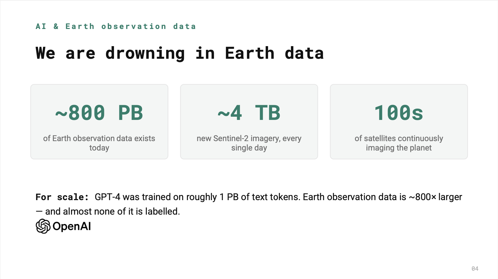

With everything going on in (geospatial) artificial intelligence, you may have 
encountered the terms "foundation model" and "(earth) embeddings"[^embedding]. 
Maybe you haven't yet had time to look into, or even apply, these concepts. If 
that's where you stand, the following materials could be of interest to you.

Fresh on the heels of [ISPRS 2026][isprs][^isprs] in Toronto, [Konstantin 
Klemmer][konstantin], Principal AI Research Engineer at LDND AI, published a 
tutorial "[Towards Geospatial Embeddings][tutorial]" he held at the conference 
(I assume – I didn't participate). The tutorial features lecture parts (provided 
as PDF slides) with two hands-on coding sessions (provided as Jupyter Notebooks 
that can be run in a free [Google Colab][colab] CPU runtime). The materials were 
compiled by Konstantin, Anthony Fuller, Evan Shelhamer, Esther Rolf, and Marc 
Rußwurm and are provided for free, under an MIT license.

")

The materials don't provide the audio track of the lecture nor the verbal 
instructions for the hands-on coding parts. Nevertheless, I found the tutorial 
useful and very well designed. It doesn't go into the intricacies of how 
precisely you compute embeddings from satellite imagery and other data. But 
it covers many aspects of foundation models and (earth) embeddings at a useful 
conceptual depth and highlights their potential from a practical perspective 
and four valuable use cases:  

- Direct prediction: Feed embeddings into a small model to map forest cover, 
population or species.
- Geographic conditioning: Use embeddings as geo-priors that give your models 
location-specific context.
- Synthesis & simulation: Condition generative models — a step toward simulators 
and digital twins.
- Geo-semantic search: Find similar locations anywhere on Earth, fast – query 
by example or concept.

")

If you want more material in this vein, also have a look at this compilation of 
resources by [Kiri Carini][kiri], Technical Communications Lead at Development 
Seed: "[Resources to understand geospatial embeddings][resources]". And maybe, 
fingers crossed, Development Seed will publish an "Embeddings" zine[^zine], like 
Kiri hints at the end of her article.

[^embedding]: A geospatial embedding is a compact, high-dimensional vector 
representation of a geospatial location, scene, or feature, learned so that 
similar places or patterns end up close together in vector space.
[^isprs]: ISPRS stands for "[International Society for Photogrammetry and Remote 
Sensing](https://en.wikipedia.org/wiki/International_Society_for_Photogrammetry_and_Remote_Sensing)". ISPRS 2026 was 
their 2026 conference.
[^zine]: I liked the ["Cloud-native geospatial"
zine](https://spatialists.ch/posts/2025/03/04-cloudnativegeo-approachable/)
Development Seed published in last year.

[isprs]: https://www.isprs2026toronto.com/
[konstantin]: https://www.linkedin.com/in/konstantinklemmer/
[tutorial]: https://github.com/konstantinklemmer/isprs26-embeddings-tutorial
[colab]: https://colab.research.google.com/
[kiri]: https://www.linkedin.com/posts/kcarini_one-thing-ive-noticed-while-trying-to-learn-activity-7481107012517384192-FdVG
[resources]: https://www.linkedin.com/pulse/resources-understand-geospatial-embeddings-kiri-carini-5h4xc/