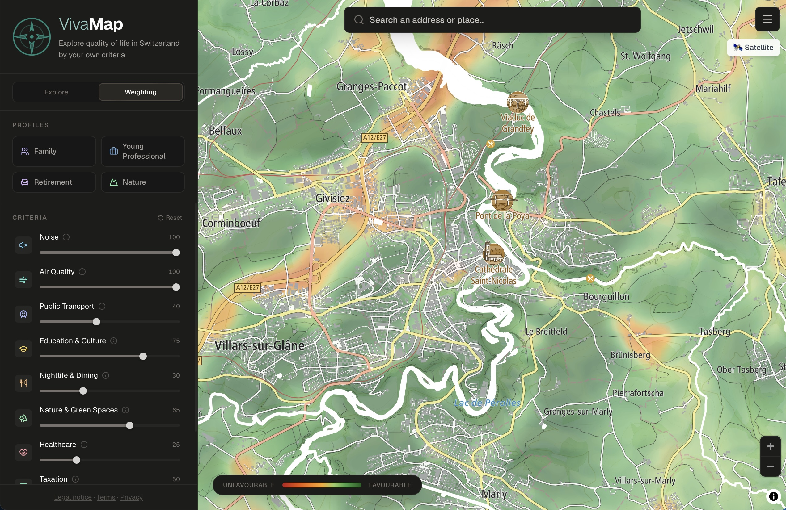
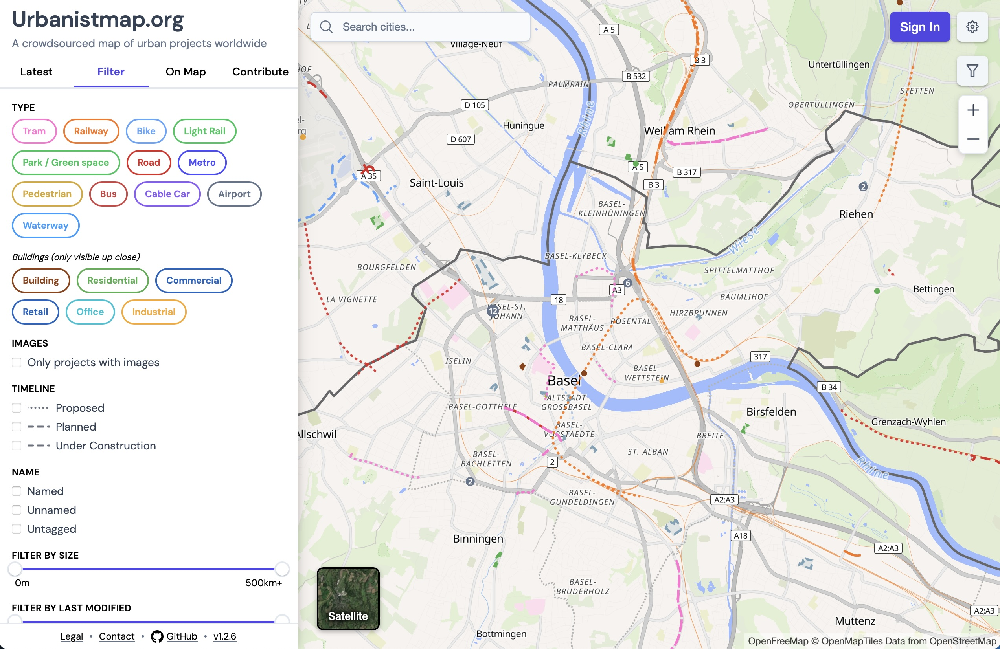

Two new web mapping applications demonstrate how open geodata can be used for 
spatial analysis and planning. Both platforms are based on OpenStreetMap (OSM) 
data and on OGD^[Open Government Data.], but have different aims and take 
different analytical and collaborative approaches.

## VivaMap: Quality-of-life indicators

[VivaMap](https://vivamap.ch/?mode=explore&lang=en) is an analytical geodata 
platform focussed on Switzerland. It combines OSM’s data on POIs^[Points of 
interest.] and buildings with various open official datasets, for example on 
noise, landcover, and public transport service quality.

- Function: The platform offers spatial indicators to assess the quality of life 
in neighborhoods (e.g., accessibility to green spaces or public transportation 
connections). Users can choose their own relative weighting of the individual 
input data sets and thus create a customised quality-of-life indicator for 
themselves. Besides, the application offers per-canton and per-agglomeration 
statistics of all input datasets.
- Application: An integrated feature allows users to directly compare different 
administrative units or areas to highlight differences in infrastructure.

## UrbanistMap: Urban development projects

[UrbanistMap](https://urbanistmap.org) is designed as a collaborative web GIS 
application for capturing and visualising urban development projects and 
infrastructure initiatives worldwide.

- Function: The platform lets the community geolocate development projects and 
infrastructure initiatives (for example construction of cycle paths, green 
spaces, buildings, railroad infrastructure, etc.) by creating geodata in a 
decentralised manner. 
- Application: The community-contributed construction sites and plans are 
displayed directly on the map and made publicly accessible, for example 
[here](https://urbanistmap.org/project/w1536136336#map=14.8/47.37199/8.54345). 
Users can select the type of projects to be shown and also filter by planning 
status and more.

