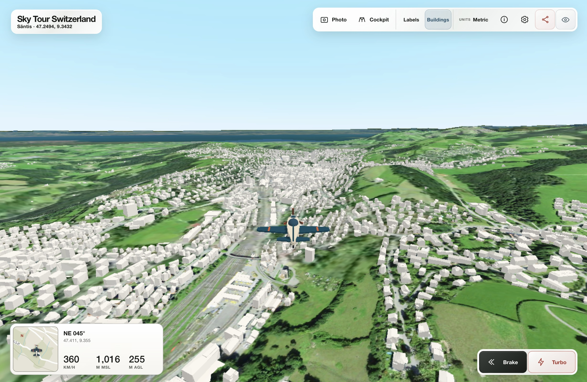

A nice little experiment by [Cédric Despierre Corporon][cedric], Senior Solution 
Architect at Esri Switzerland: Building on the [ArcGIS Maps SDK for 
JavaScript][sdk] and an ArcGIS WebScene, Cédric implemented a simple web-based 
flight simulator. The WebScene streams imagery, building, and toponym[^toponyms] 
data from swisstopo, elevation and other topographic data from Esri, and 
toponyms (outside Switzerland) from OSM[^osm] through ArcGIS Online (and from a 
GeoParquet file, in one case).

[][sim]

Obviously, this is not (yet?^[🤞]) a full-fledged flight simulator[^simulation], 
but definitely an impressive technology showcase.

[Here][sim] you can try your flying chops (should also work with recent handheld 
devices, though I haven't checked), and [here][post] is the accompanying 
LinkedIn post by Cédric.

[cedric]: https://www.linkedin.com/in/cedricdespierrecorporon
[scene]: https://www.arcgis.com/home/webscene/viewer.html
[sdk]: https://developers.arcgis.com/javascript/latest/
[sim]: https://ceddc.ch/arcgiskytour/
[post]: https://www.linkedin.com/posts/cedricdespierrecorporon_arcgis-webgis-3dgis-activity-7487454215993352193-AErC
[^toponyms]: Place names.
[^osm]: [OpenStreetMap](https://www.openstreetmap.org/), a collaborative, open-licensed map of the world.
[^simulation]: For example: No cockpit dashboard, speed controls are limited to an (air)brake and a (fun!) turbo mode, roll and yaw are coupled, no articulated control surfaces on the plane. Two quick wins (for me) would be: inverting the pitch controls, so that "arrow down" is (the conventional) "pitch up" and showing banking in the cockpit view.