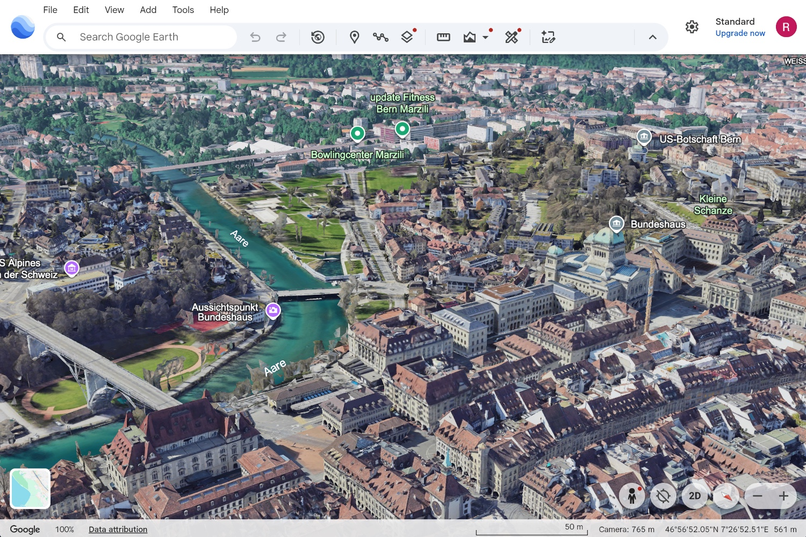
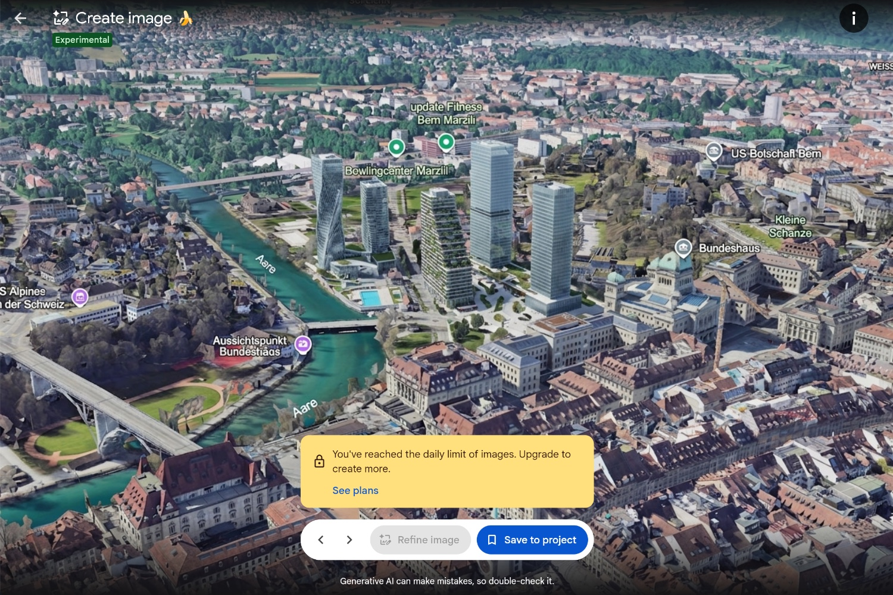

Yesterday, Google has added a GenAI[^genai] function to [Google Earth][earth] through a new button 
"Create image". It uses Nano Banana 2[^nanobanana] to manipulate Google Earth imagery based on user 
prompts. The function creates only a (static) image: Once you enter GenAI mode, you can no longer 
change the location or perspective of the scene you're viewing. 

[Google's announcement][announcement] of this new (and currently labelled "experimental") 
functionality portrays it as a fun, educational, or planning feature:

> Have you ever looked at an empty lot in your neighborhood and imagined a community garden, or 
wondered what your city looked like a century ago?

The examples in the announcement include, among others, Pompeii the way it may have looked 
historically, an infographic about the Statue of Liberty, and a real estate plan for an empty lot in 
Tokyo.

[Henk van Ess][henk], an investigator, tool builder, and trainer with decades of experience in 
online research and OSINT[^osint], has shared his [critical perspective][post]. In a [longer 
article][article], he analyses the feature through his own tests (of the feature and of purported 
safety measures) and thinks through the ramifications of tightly integrating GenAI and Google 
satellite imagery: 

> You only censor a map that works. Every blur, every polygon, every diplomatic request was an 
admission that Google Earth was accurate enough to be dangerous. Governments were not worried the 
map would lie. They were worried it would tell the truth. 
> Google’s position never wavered. It does not blur satellite imagery by choice. Sites come 
pre-obscured because a government or a supplier requires it as a condition of flying over.
> 
> So to take one real building out of Google Earth, you need a state. To put a nuclear plant into 
Iran, I needed a sentence.

He also shares a response from Google about this critical viewpoint. Very much [worth 
reading][article]!

One nuance I haven't seen raised often (Henk touches upon it): of course, one could already take screenshots from Google Earth and edit them with any (also non-Google) GenAI tools already before the Nano Banana feature 
arrived. But seamlessly integrating this functionality in a global product such as Google Earth puts 
"GenAI satellite imagery" at the fingertips of billions of people. 

I also wonder about Google's long-term ideas around this feature. As mentioned above: Currently, a 
static image is generated and you cannot change your perspective on the site in question anymore. 
But some of Google's examples in the [announcement][announcement], for example the real estate 
plans, would obviously benefit from users being able to navigate through GenAI scenes in the same 
way they do through reality-grounded scenes in Google Earth. This could augment both the GenAI 
feature's value and its danger.

[^genai]: "Generative AI", that is artificial intelligence systems that generate new media (text, code, images, audio, video) rather than only analysing or classifying existing data.
[^nanobanana]: Nano Banana is an image-generation model.
[^osint]: "OSINT" is short for "open-source intelligence", that is information gathered from publicly available sources.

[earth]: https://earth.google.com
[announcement]: https://blog.google/products-and-platforms/products/earth/nano-banana-google-earth-image-generation/
[henk]: https://www.linkedin.com/in/searchbistro/
[post]: https://www.linkedin.com/posts/searchbistro_i-cant-believe-what-google-did-since-tonight-ugcPost-7488677909709246464-G8tD
[article]: https://www.digitaldigging.org/p/how-to-plant-a-nuclear-plant-in-iran

