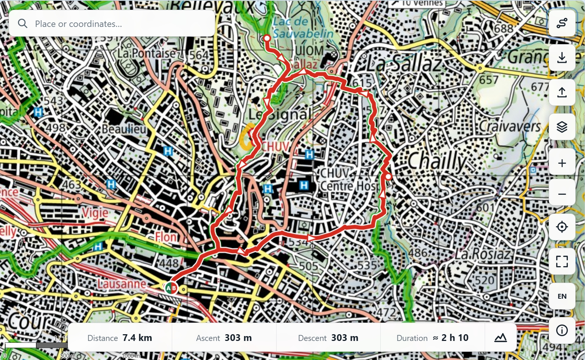

[Via Helvetica][via-helvetica] is a new web-based hiking planner. Designed and 
developed by [Philippe De Pol][philippe], this app offers a simple and 
intuitive interface for planning hiking routes across Switzerland. The app is 
available in German, French, Italian, and English and is free to use without an 
account.

The app uses official Swiss basemaps and geodata. It allows drafting hiking 
routes along the network of hiking trails (and other paths). You can adjust 
routes manually or skip adherence to trails entirely using the "magnet" button. 
Route direction can be flipped and routes can be turned into a circular 
hike[^circular] at the press of a button.

[][via-helvetica]

The app shows metrics for distance, ascent, and descent as well as an estimate 
for the duration of the hike. Further, [Via Helvetica][via-helvetica] can show 
the elevation profile of the route. There is a GPX[^gpx] file import and export. 
Routes can also easily be brought into the swisstopo[^swisstopo] [mobile app][app] 
via a QR code.

To me, this app stands out for its simplicity: With its clean user interface – a 
handful of buttons, five layers – it serves a very clear use-case. Reminds me a 
lot (in a positive sense) of Brian Timoney's classic _"Why map portals don't 
work"_ series, especially parts [_II – Paralysis of choice_][II], 
[_III – The tyranny of "requirements"_][III], and 
[_IV – An iconography of confusion_][IV]. 

[Via Helvetica][via-helvetica] is [open-source][repo] under the MIT license and 
its [developer][philippe] is actively seeking feedback.

[via-helvetica]: https://viahelvetica.ch/
[philippe]: https://www.linkedin.com/in/philippe-de-pol/
[app]: https://spatialists.ch/posts/2026/07/17-swisstopo-app-updates/
[II]: https://mapbrief.com/2013/02/07/paralysis-of-choice-why-map-portals-dont-work-part-ii/
[III]: https://mapbrief.com/2013/02/11/the-tyranny-of-requirements-why-map-portals-dont-work-part-iii/
[IV]: https://mapbrief.com/2013/02/19/an-iconography-of-confusion-why-map-portals-dont-work-part-iv/
[repo]: https://github.com/egofree71/via-helvetica

[^circular]: At first, I thought the _circular hike_ function tries to find a 
route that keeps the length of paths travelled twice small (i.e., truly "opening 
the loop" like the button's hover text suggests). But during further tests, I 
got identical "to" and "from" paths in the majority of cases. 
[^gpx]: GPS Exchange Format, an open XML-based file format for exchanging
waypoints, tracks, and routes between GPS devices and applications.
[^swisstopo]: The Federal Office of Topography of Switzerland.