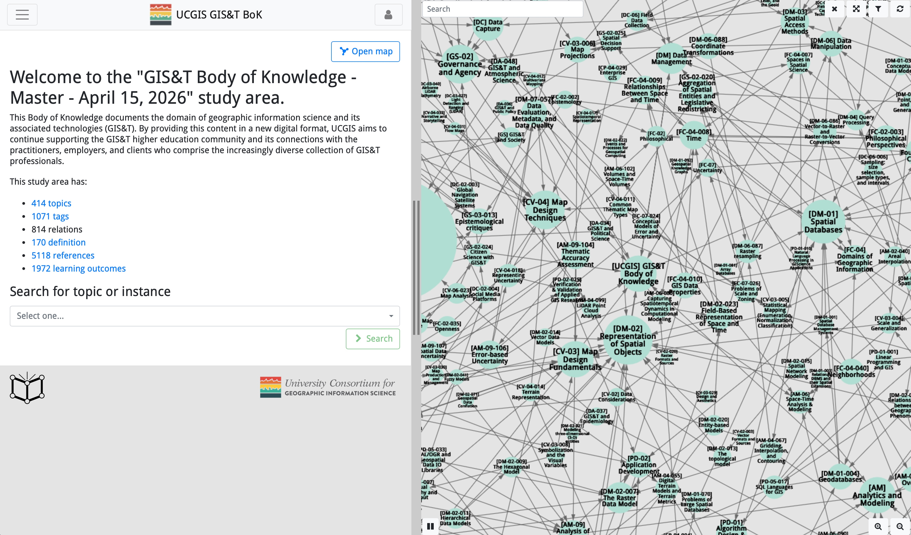

Two potentially interesting learning resources: 

## Guide to the Geographic Approach

The UCSB[^ucsb] and Esri collaborated on a YouTube GIScience[^giscience] curriculum. Titled "Guide to the
Geographic Approach", the materials encompass around 100 videos ranging in length from 2 to 15 
minutes each.

The Guide has 20 [project-based modules][modules] combining GIS background, ethical lessons, 
technical skills, and problem-based labs, [video lectures][lectures], [ethics lessons][ethics], and 
a discussion board (the videos are [on YouTube][yt]). It covers quite a wide range of topics. 

A landing page, [theuscbguide.com][page], offers more information: 

> Based on input from across the GIS community, it offers materials for teaching GIS and GIScience 
using the most up-to-date technologies and teaching approaches. The UCSB Guide emphasizes workflows, 
ethics, and cloud computing for applied problem solving. Built using project-based learning, the 
UCSB Guide integrates conceptual understanding and applied skills through case studies and hands-on 
activities. Developing a foundational skillset rooted in modern GIS will enable future professionals 
in any industry to apply geospatial thinking and analysis to solve new and existing problems.



The problem-based labs and technical skills use Esri-based examples, though not exclusively. If you 
are not a user of Esri products, the theoretical and ethical contents may appeal more to you than 
the more applied parts. 

## GIS&T Body of Knowledge

The UCGIS[^ucgis], a non-profit organisation that creates and supports communities of practice in 
GIScience and whose [membership][members] consists of a large number of USA-based universities, 
offers the [Geographic Information Science and Associated Technologies Body of Knowledge][bok] (or 
GIS&T BoK, for short). The GIS&T BoK is an online resource that explains GIScience concepts and 
theories (on average, in more technical depth than the _Guide to the Geographic Approach_, I would 
say).

Users can navigate through the following knowledge areas and discover topics and sub-topics 
interactively: 

- Analytics and Modeling
- Computing Platforms
- Cartography and Visualization
- Domain Applications
- Data Capture
- Data Management
- Foundational Concepts
- GIS&T and Society
- Knowledge Economy
- Programming and Development

Overall, the [GIS&T BoK][bok] holds more than 400 topics. A [dashboard][db] offers a map view: 

From what I have seen, the GIS&T BoK is vendor-neutral.

[page]: https://www.theucsbguide.com/
[modules]: https://www.theucsbguide.com/pages/module
[lectures]: https://www.theucsbguide.com/pages/21266b97b5834269a402e103f3100e4a
[ethics]: https://www.theucsbguide.com/pages/ethics
[yt]: https://www.youtube.com/@TheUCSBGuide/videos
[members]: https://www.ucgis.org/site/members
[bok]: https://gistbok-topics.ucgis.org/UCGIS
[db]: https://gistbok-ltb.ucgis.org/page/current/dashboard

[^ucsb]: University of California, Santa Barbara.
[^giscience]: Geographic Information Science, the scientific study of the fundamental concepts, methods, and theories underlying geographic information systems and geospatial data.
[^ucgis]: University Consortium for Geographic Information Science.