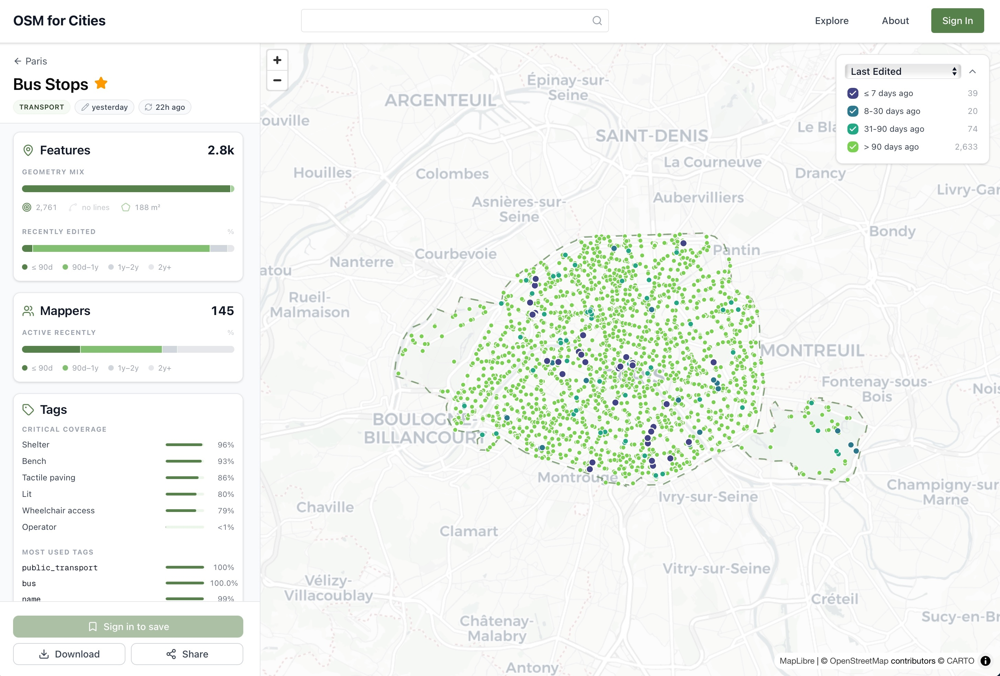

*[OSM for Cities][ofc]*, initiated by [Vitor George][vitor], is a platform which enables users to 
explore data and automatically receive updates from OpenStreetMap[^osm].

Using OSM for Cities, uers can visually explore OSM data in their area-of-interest and download data
in GeoJSON[^geojson] format. They can also choose an area and a data topic (for example, transit stops, parks, schools, etc.) and 
will then receive e-mails (daily or weekly summaries) when their watched data changes. That way, 
users can stay abreast of changes based on signals from OSM. 

Of course, depending on the completeness of OSM in the area-of-interest, users will still need to 
look closely in order to distinguish real-world changes that made it into OSM from pure OSM changes 
that do not reflect a development in the real world.

The [project][ofc] is [open-source][repo], under the MIT license. Overall, this seems like an 
elegant service that may cover some use-cases around change detection well.

[ofc]: https://osmforcities.org/
[vitor]: https://github.com/vgeorge
[repo]: https://github.com/osmforcities/osmforcities

[^osm]: [OpenStreetMap](https://www.openstreetmap.org/), a collaborative, open-licensed map of the world.
[^geojson]: An open standard format for encoding vector spatial data structures using JSON (JavaScript Object Notation).