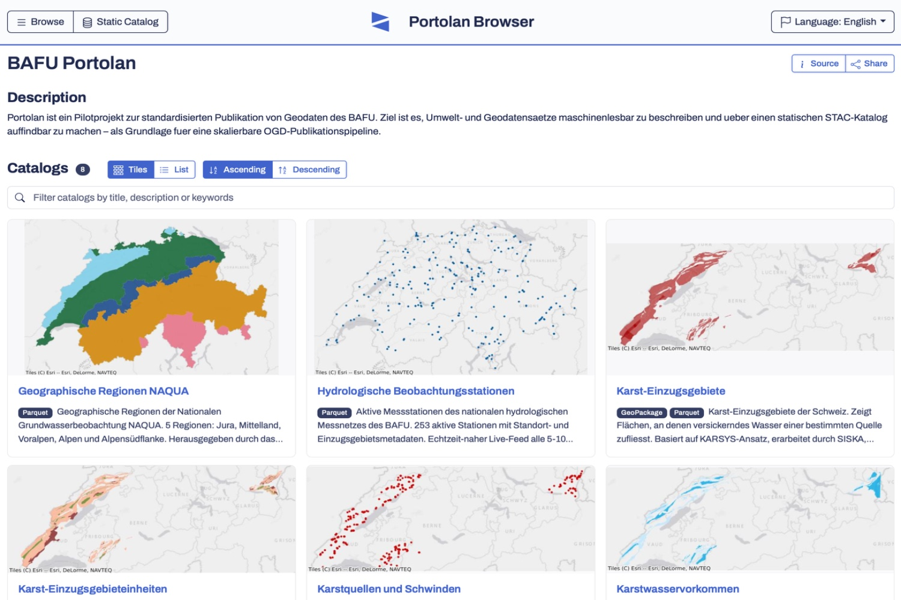

Last week, [Portolan][portolan-launch][^portolan] officially launched. This is 
an open-source toolkit built around a simple, but radical idea: A spatial data
infrastructure[^sdi] doesn't have to be a server – it can just be files in 
cloud storage.

Portolan converts geodata into cloud-native[^cloud-native] formats (GeoParquet,
COG[^cog], PMTiles), generates STAC[^stac] metadata, and publishes everything to
S3 or S3-compatible providers – no database, no API, no infrastructure to
maintain. The resulting catalog is directly queryable from QGIS, Python,
DuckDB[^duckdb], or AI agents.

More info is available in the [official launch post][portolan-launch]. 

I gave it a try[^transparency]: In a few days, without a server and without an 
IT project, FOEN[^foen] environmental data is published as a Portolan catalog – 
open, machine-readable, and AI-ready:

[FOEN Portolan pilot][foen-pilot]

[][foen-pilot]

[portolan-launch]: https://www.portolan-sdi.org/blog/introducing-portolan
[foen-pilot]: https://browser.portolan-sdi.org/#/external/ron-portolan.s3.eu-central-1.amazonaws.com/portolan/catalog.json
[portolan-charts]: https://en.wikipedia.org/wiki/Portolan_chart

[^portolan]: The name draws on historical nautical maps, [portolan charts][portolan-charts].
[^sdi]: SDI.
[^cloud-native]: I.e., taking full advantage of the cloud computing model; in the data world typically through enabling [partial downloads](https://blog.sogeo.services/blog/2023/12/29/statuscode-206-letsgetstarted.html) of file contents through so-called [HTTP range requests](https://developer.mozilla.org/en-US/docs/Web/HTTP/Range_requests).
[^cog]: Cloud-optimized GeoTIFF.
[^stac]: STAC stands for "SpatioTemporal Asset Catalog", a modern, open specification for cataloging spatio-temporal data.
[^duckdb]: [DuckDB](https://www.duckdb.org/why_duckdb) is an open-source column-oriented Relational Database Management System (RDBMS) designed for analytics use-cases.
[^transparency]: Transparency note: I work for the Federal Office for the
Environment.
[^foen]: The Federal Office for the Environment (FOEN; BAFU in German, OFEV in 
French) is the Swiss federal agency responsible for the state and development 
of Switzerland's environment.