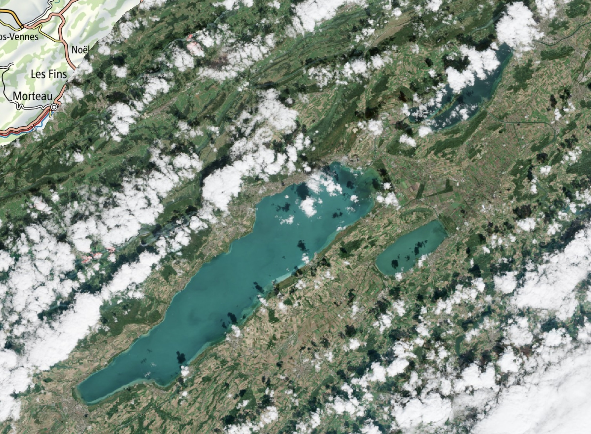

For a while, swisstopo[^swisstopo] has been offering swissEO S2-SR as part of its swissEO data products. The [swissEO S2-SR
product][sr] is a Sentinel-2 surface reflectance product at spatial resolutions of 10m, 20m, and
60m that has been atmospherically corrected and is suitable for various applications, including land
cover mapping, vegetation monitoring, and environmental analysis.

Now, swisstopo bumped [swissEO S2-SR][sr] from version 100 (which is still available until the end 
of 2026) to version 200. This version [brings the following improvements][announcement], among 
others the following new or improved features:

- Full band coverage: All 13 Sentinel-2 bands (B01–B12 plus AOT) are now processed at their native 
resolutions and made available as individual COGs[^cogs].

- Shorter latency: The data is now available 10 to 24 hours after acquisition, rather than after 
around three days.

- New cloud and terrain shadow mask: Cloud and shadow detection is now carried out using 
[OmniCloudMask](https://github.com/DPIRD-DMA/OmniCloudMask) using a neural network-based approach. 
The terrain shadow mask is generated using [HORAYZON](https://github.com/ChristianSteger/HORAYZON).

- Scene classification: Newly included, with the Copernicus standard classes 0 to 11.

- True-colour image: Available independently as a COG.

- Forecast and ‘No Data’ orbits as CSVs: The list of upcoming orbits and the days without usable 
imagery can now be accessed directly via STAC[^stac].

Many nice improvements indeed! swisstopo recommends that existing applications be migrated to v200 
soon, and latest by the end of 2026. During the update, special consideration should be given to the 
newly scaled pixel values of the spectral bands. 

[sr]: https://www.swisstopo.admin.ch/en/satelliteimage-swisseo-s2-sr

[^swisstopo]: The Federal Office of Topography of Switzerland.
[^cogs]: Cloud-optimized GeoTIFFs
[^stac]: STAC stands for "SpatioTemporal Asset Catalog", a modern, open specification for cataloging spatio-temporal data.

