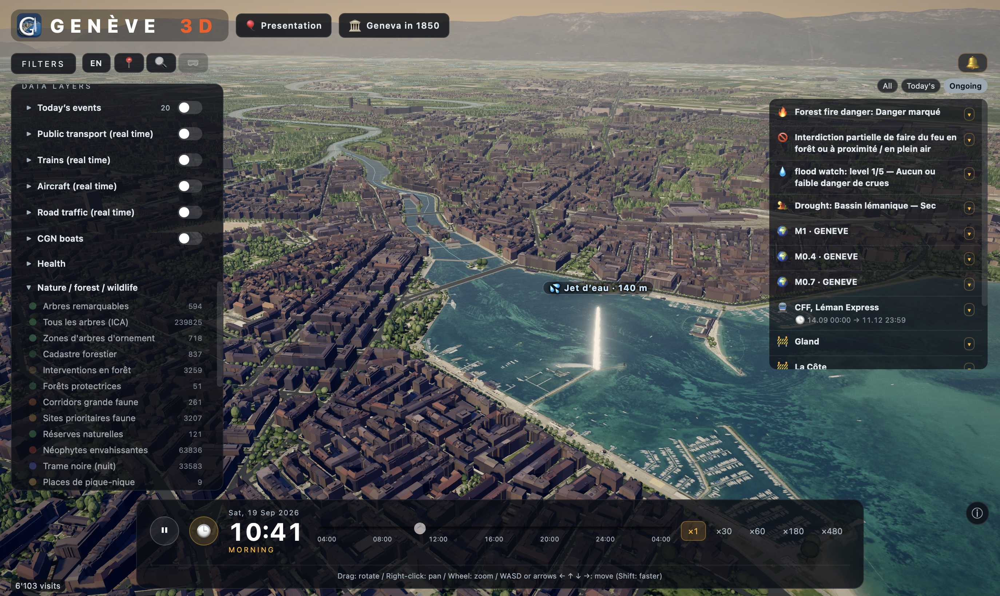
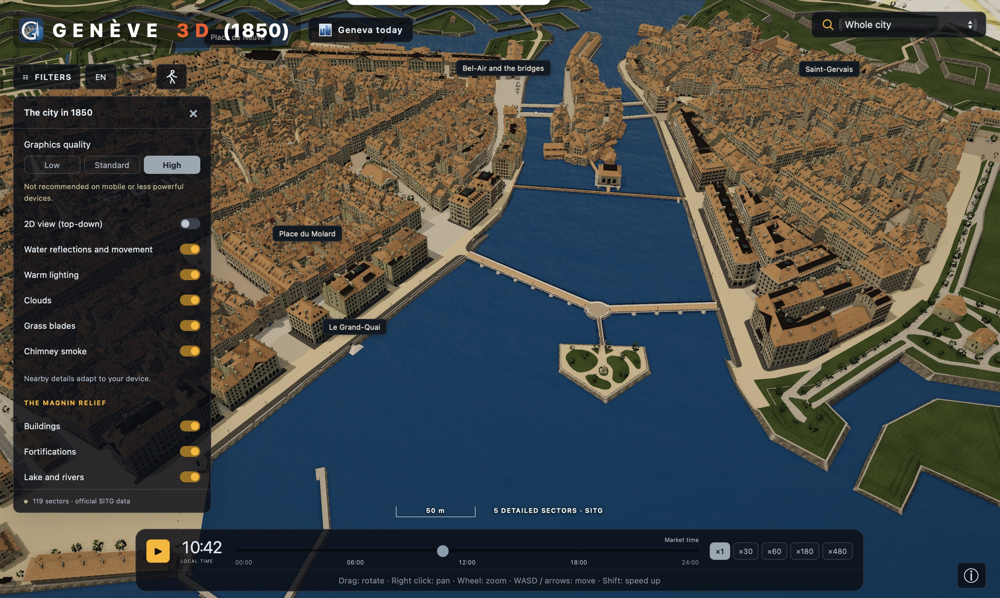

Over the last few months[^think] and in his spare time, [Arnaud Ricci][arnaud] 
has been developing [Geneva 3D][ge3d], an animated and interactive 3D model of 
Geneva, Switzerland. [Geneva 3D][ge3d] combines dozens of geodata assets in a 
performant and visually appealing 3D web app.

Lighting conditions, weather, public transport including aviation, and road 
traffic are shown in real-time – based on real-time data or on modelled data, 
the latter for road traffic. Data comes from the SITG[^sitg], 
opentransportdata.swiss, Open-Meteo, eautemp.com, OpenStreetMap[^osm], the 
FOEN[^foen], the SED[^sed] and ETH Zurich, Mapzen, and swisstopo[^swisstopo].

The app also features a [reconstruction of Geneva in 1850][ge3d1850]:

[Geneva 3D][ge3d] is available in English, French, German, and Italian, and 
features a guided tour (the "Presentation" button), which is a good way to 
familiarise oneself with its functionality. As far as I could see, the code is 
not open source. On LinkedIn, [Arnaud posts about his progress][linkedin] and 
the feautures of [Geneva 3D][ge3d].

[arnaud]: https://www.linkedin.com/in/arnaud-ricci-592847b6/
[ge3d]: https://geneva3d.ch/
[ge3d1850]: https://geneva3d.ch/1850/
[linkedin]: https://www.linkedin.com/in/arnaud-ricci-592847b6/recent-activity/all/

[^think]: I think, based on [Arnaud's LinkedIn feed][linkedin].
[^sitg]: [Système d'Information du Territoire à Genève](https://sitg.ge.ch/).
[^osm]: OSM.
[^foen]: The Federal Office for the Environment of Switzerland.
[^sed]: The Swiss Seismological Service (Schweizerischer Erdbebendienst) at ETH 
Zurich, responsible for monitoring and reporting seismic activity in Switzerland.
[^swisstopo]: The Federal Office of Topography of Switzerland.