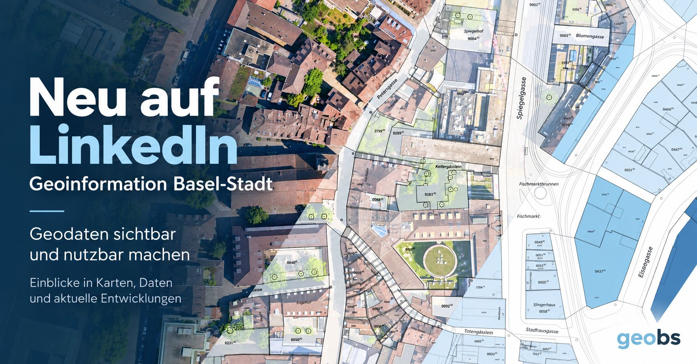

Since this week, the Geoinformation team of the Canton of Basel-Stadt has 
[a LinkedIn presence][bs]. From their [first post][first]: 

> Geoinformation Basel-Stadt is now on LinkedIn!
> On this channel, we provide an insight into the latest developments and show:
> 
> 📍 what’s changing with MapBS, MapBS 3D and the geoportal
> 🔌 which geoservices and APIs are available
> 🧭 how geodata can be used in planning and administration
> 📊 which new datasets are being published
> 💡 how data can be found, combined and reused more easily
> 🤝 where networking and shared data use create new opportunities
> 
> Our LinkedIn channel is aimed at planners, architects, GIS specialists, 
developers, specialist agencies, universities and partner organisations, as 
well as anyone with an interest in geodata.
> 
> Our aim: not just to provide geodata, but to highlight its benefits.

[][bs]

This is a welcome addition to the other cantonal geoinformation offices that 
have a similar presence:

- Geneva: [Système d'information du territoire à Genève (SITG)](https://www.linkedin.com/showcase/sitg-geneve/)
- Thurgau: [Amt für Geoinformation Kanton Thurgau](https://www.linkedin.com/company/amt-für-geoinformation-kanton-thurgau) 
- Zug: [Amt für Grundbuch und Geoinformation Kanton Zug](https://www.linkedin.com/company/amt-für-grundbuch-und-geoinformation)

Always nice to see additions to the geospatial online ecosystem (and the broader 
"digital" and "data" ecosystem), as any exchange among professionals in our 
industry is valuable. Let's build 
[smart networks](https://blogs.cornell.edu/info2040/2015/09/10/a-diverse-twitter-network-can-generate-better-ideas/).

[bs]: https://www.linkedin.com/company/geoinformation-kanton-basel-stadt/posts/
[first]: https://www.linkedin.com/posts/geoinformation-baselstadt-geodaten-share-7506248309838311424-eh2a