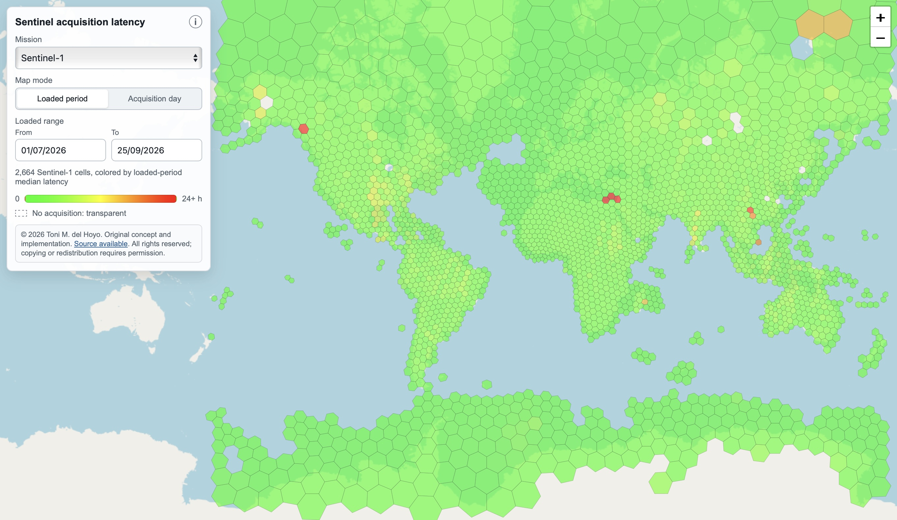

Toni Del Hoyo wondered about Sentinel data publication latency, that is how 
long it takes for Sentinel data to become publicly available after acquisition:

> The idea for a Sentinel Latency project had been sitting in my backlog for 
months. I kept wondering: how fast and predictable is Sentinel data publication 
in practice? Does latency vary by geography? Is Sentinel-1 different from 
Sentinel-2? Do areas closer to polar ground stations get published faster? Are 
there patterns that suggest technical constraints, operational policies, or 
geopolitical factors?

So Toni built a [web app that tracks publication latency for Sentinel-1 and 
Sentinel-2 data][app] and visualises the results on a map for either a specific 
day or a date range^[Date ranges are entered in the `dd/mm/yyyy` format.]. Watch 
out: Visualising long date ranges can be slow, as the app queries many 
STAC[^stac] pages and writes many H3[^h3] records.

You can find considerably more context in Toni's [Medium article][article] about 
the project, including a discussion of the results.

The source code behind the map is [available on GitHub][repo]. The app has 
obvious use cases in the remote sensing industry. But I think it could also be 
generalised to other frequently updated STAC-indexed geodata assets where time 
is of importance. Copying and modifying the app's source code is dependent on 
written permission from Toni. 

[app]: https://tonidelhoyo.com/projects/sentinel-latency/
[article]: https://medium.com/@tonidelhoyo/tracking-sentinel-publication-latency-around-the-world-d4b50b0141d0
[repo]: https://github.com/thoyo/sentinel-latency

[^stac]: STAC stands for "SpatioTemporal Asset Catalog", a modern, open 
specification for cataloging spatio-temporal data.
[^h3]: [H3](https://h3geo.org) is a hexagonal (mostly, except for 12 pentagons 
– think: football) discrete global grid system (DGGS) (Apache 2.0-licensed) 
created by Uber.