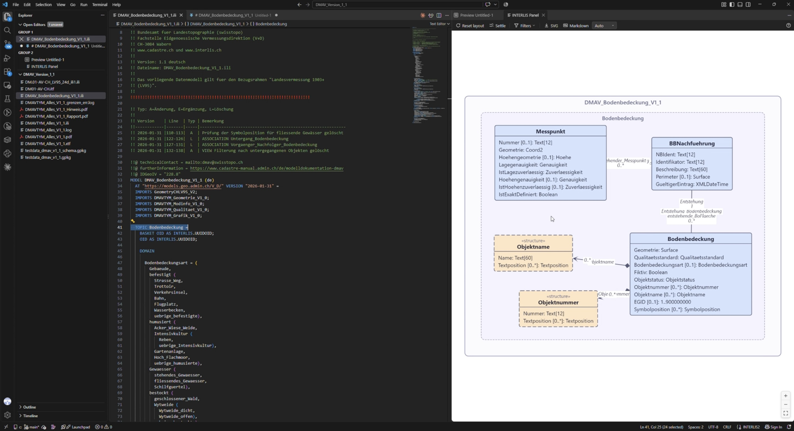

[geowerkstatt][geowerkstatt] have been offering an INTERLIS 2[^interlis] language extension 
for Microsoft Visual Studio Code since 2023. With added features, they released 
the version 1.0.0 of it. The extension is available on the [Visual Studio 
Marketplace][ext]. It is [open-source][repo] under the MIT license. 

There is an [accompanying blog post][post] (in German) that details the 
improvements in this version, partly based on geowerkstatt's own C#-based 
INTERLIS 2 compiler. Some features of this VS Code extension include: 

- Highlighting of INTERLIS 2 keywords and syntax
- Highlighting of syntax errors, unresolved references, invalid paths, and type 
errors
- Automatic generation of interactive UML[^uml] class diagrams from INTERLIS 2 models
- Automatic generation of Markdown object catalogues from INTERLIS 2 models
- Import of models that are currently under development, even if they are not 
yet found in model repositories

Besides this INTERLIS 2 extension from geowerkstatt, the ecosystem offers [a 
few more INTERLIS 2 tools][tools], among them the similarly spec'ed "[INTERLIS 
Editor][stefan]"[^connaisseurs] by Stefan Ziegler.

Always good to see tools that make professionals' lives easier. I do feel that a 
collation of useful and well-maintained INTERLIS 2 tools in one place is in 
order.

[geowerkstatt]: https://www.geowerkstatt.ch/
[ext]: https://marketplace.visualstudio.com/items?itemName=geowerkstatt.interlis2
[repo]: https://github.com/geowerkstatt/vsc_interlis2_extension
[post]: https://www.geowerkstatt.ch/blog/interlis-vs-code-extension-10-die-ide-fr-interlis-modelliererinnen
[tools]: https://marketplace.visualstudio.com/items?itemName=edigonzales.interlis-editor
[stefan]: https://marketplace.visualstudio.com/items?itemName=edigonzales.interlis-editor

[^interlis]: [INTERLIS](https://www.interlis.ch/en) is a Swiss standard for geodata modelling and data exchange.
[^uml]: Unified Modeling Language.
[^connaisseurs]: Connaisseurs recognise it by its slightly off-brand icon 🙂.